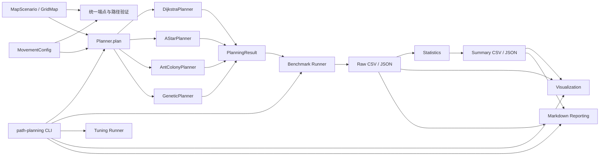

# PathPlanningLab 四算法统一路径规划项目实施计划

> **执行代理要求：**正式执行时使用 `superpowers:executing-plans` 和 `superpowers:test-driven-development`，按任务顺序逐项实施；每个任务只能在验证通过后勾选。

**目标：**构建一个真实、统一、可复现、可测试的二维栅格路径规划项目，实现 Dijkstra、A*、ACO、GA，并以完整实验数据支撑简历技术表述。

**架构：**采用 `src` 布局的模块化 Python 包。核心地图、移动规则、结果模型与验证逻辑由四种算法共享；Benchmark、调优、可视化和报告均消费统一的 `PlanningResult`，避免脚本间重复实现。

**技术栈：**Python 3.12.2（保持 Python ≥3.11 兼容）、NumPy、Matplotlib、pandas、PyYAML、DEAP、pytest、pytest-cov、Ruff、mypy、setuptools。

## 执行清单

- [x] S1-T01 安全门禁与记录制度落地
- [x] S1-T02 Python工程与 feature 分支初始化
- [ ] S1-T03 GridMap 与移动规则
- [ ] S1-T04 统一结果与 Planner 接口
- [ ] S1-T05 路径验证与统一指标
- [ ] S1-T06 地图 I/O 与手工地图
- [ ] S1-T07 可复现随机地图和数据集隔离
- [ ] S1-T08 阶段1集成门禁
- [ ] S2-T01 Dijkstra
- [ ] S2-T02 A* 与启发函数
- [ ] S2-T03 确定性算法回归矩阵
- [ ] S2-T04 阶段2门禁与算法文档
- [ ] S3-T01 ACO 配置、构路和历史缺陷基线
- [ ] S3-T02 ACO 信息素更新与收敛
- [ ] S3-T03 ACO 完整 Planner 集成
- [ ] S3-T04 阶段3门禁
- [ ] S4-T01 GA 配置、DEAP 类型、初始化与适应度
- [ ] S4-T02 GA 修复、交叉和变异
- [ ] S4-T03 GA 选择、精英和演化循环
- [ ] S4-T04 GA 集成与复现性
- [ ] S4-T05 阶段4门禁
- [ ] S5-T01 Benchmark schema 与任务展开
- [ ] S5-T02 公平 Benchmark Runner
- [ ] S5-T03 原始结果与环境元数据
- [ ] S5-T04 自动统计和归一化
- [ ] S5-T05 真实 Smoke Benchmark 与阶段门禁
- [ ] S6-T01 调优集合、参数空间和选择规则
- [ ] S6-T02 ACO 参数调优
- [ ] S6-T03 GA 参数调优
- [ ] S6-T04 baseline/tuned 对比与阶段门禁
- [ ] S7-T01 路径可视化
- [ ] S7-T02 收敛和指标可视化
- [ ] S7-T03 CLI 地图生成与单次规划
- [ ] S7-T04 CLI Benchmark、调优和报告
- [ ] S7-T05 README、报告和简历证据
- [ ] S7-T06 阶段7端到端门禁
- [ ] S8-T01 独立环境安装与构建
- [ ] S8-T02 全量质量门禁
- [ ] S8-T03 独立 CLI 与 Smoke 验收
- [ ] S8-T04 Standard Benchmark
- [ ] S8-T05 最终统计、图表和技术结论
- [ ] S8-T06 Git、旧材料和最终独立审计

---

## 1. 计划摘要

- 实施任务：42 项。
- 最终验收项：29 项。
- 阶段：S1 至 S8。
- 所有实施任务初始状态：`Not Started`。
- 初始计划编制风险：低；当时仅输出计划，没有工程实施写入。
- 后续实施风险：中；所有写入限于 `/Users/jiaxulong/Desktop/PathPlanningLab`，但包含依赖安装、长时间随机实验和本地 Git commit。
- 旧目录 `/Users/jiaxulong/Desktop/论文与实习` 始终只读，旧 ACO/GA 不执行。
- 不引入 React、FastAPI、数据库、Docker、ROS、CARLA、强化学习、神经网络或云部署。
- 不创建重复的 `scripts/` 包装器；统一使用 `path-planning` CLI 和可直接调用的 Python API。
- Standard Benchmark 固定为 21 个地图/移动任务、ACO/GA 各 baseline/tuned × 20 seeds，确定性算法 3 次预热、10 次正式计时。
- Standard Benchmark 默认串行执行，预计 6–24 小时；调优预计 4–12 小时。
- 结果必须如实保存；调优版本没有提升时仍然视为有效实验结果，不修改指标或筛除失败样本。

### 全局执行约束

#### Repository baseline（2026-07-18对齐）

- `/Users/jiaxulong/Desktop/PathPlanningLab`是已经初始化的Git仓库；后续任务严禁再次执行`git init`，严禁删除、替换或重建`.git`。
- 当前基线分支为`main`，上游为`origin/main`；唯一remote必须是`origin`，Fetch/Push URL必须保持为`git@github.com:xulong-jia/PathPlanningLab.git`。
- 计划基线已经推送到GitHub。后续commit未经用户明确授权不得push；严禁force push、增加第二个remote、修改remote URL、merge、rebase或tag。
- S1-T01只验证现有仓库和旧材料保护门禁，不创建或重新初始化仓库。
- S1-T02在确认更新后的`main`干净且与`origin/main`一致后，从`main`创建`feature/path-planning-100`；不得从历史提交或其他分支创建。

所有命令从项目根目录执行，并先设置项目内缓存：

```bash
mkdir -p .tmp .pip-cache .cache .mplconfig .pycache .pytest-tmp results/verification

export TMPDIR="$PWD/.tmp"
export PIP_CACHE_DIR="$PWD/.pip-cache"
export XDG_CACHE_HOME="$PWD/.cache"
export MPLCONFIGDIR="$PWD/.mplconfig"
export PYTHONPYCACHEPREFIX="$PWD/.pycache"
export MPLBACKEND="Agg"
```

每项任务的验证输出使用：

```bash
set -o pipefail
{
  <该任务列出的命令>
} 2>&1 | tee results/verification/Sx-Txx.txt
```

测试先行任务另存 RED 证据为 `results/verification/Sx-Txx-red.txt`。RED 命令预期非零退出；最终验证命令必须退出码为 0。

每个任务都要更新：

- `docs/superpowers/plans/2026-07-18-path-planning-lab.md`
- `docs/progress/PROJECT_STATUS.md`
- `docs/progress/WORK_LOG.md`

每个阶段门禁任务还要更新：

- `docs/progress/HANDOFF.md`

---

## 2. 文件职责与接口图

### 2.1 计划工程结构

```text
PathPlanningLab/
├── pyproject.toml
├── requirements.lock
├── README.md
├── .gitignore
├── configs/
│   ├── map_generation.yaml
│   ├── dijkstra.yaml
│   ├── astar.yaml
│   ├── aco_baseline.yaml
│   ├── aco_tuned.yaml
│   ├── ga_baseline.yaml
│   ├── ga_tuned.yaml
│   ├── benchmark_smoke.yaml
│   ├── benchmark_standard.yaml
│   └── tuning.yaml
├── maps/
│   ├── handcrafted/
│   └── generated/
│       ├── tuning/
│       └── evaluation/
├── src/path_planning/
│   ├── __init__.py
│   ├── cli.py
│   ├── reporting.py
│   ├── core/
│   │   ├── types.py
│   │   ├── grid.py
│   │   ├── movement.py
│   │   ├── result.py
│   │   ├── validation.py
│   │   └── metrics.py
│   ├── maps/
│   │   ├── io.py
│   │   ├── generation.py
│   │   └── suites.py
│   ├── algorithms/
│   │   ├── base.py
│   │   ├── dijkstra.py
│   │   ├── astar.py
│   │   ├── aco.py
│   │   └── genetic.py
│   ├── benchmark/
│   │   ├── schemas.py
│   │   ├── runner.py
│   │   ├── statistics.py
│   │   └── metadata.py
│   ├── tuning/
│   │   ├── spaces.py
│   │   └── runner.py
│   └── visualization/
│       ├── paths.py
│       ├── convergence.py
│       └── comparisons.py
├── tests/
│   ├── unit/
│   ├── integration/
│   ├── regression/
│   └── fixtures/maps/
├── results/
│   ├── verification/
│   ├── smoke/
│   ├── tuning/
│   └── standard/
└── docs/
    ├── superpowers/
    │   ├── specs/2026-07-18-four-algorithm-path-planning-design.md
    │   └── plans/2026-07-18-path-planning-lab.md
    ├── progress/
    │   ├── PROJECT_STATUS.md
    │   ├── WORK_LOG.md
    │   └── HANDOFF.md
    ├── audit/
    │   ├── legacy_hashes.before.sha256
    │   └── legacy_hashes.after.sha256
    ├── architecture.md
    ├── algorithms.md
    ├── benchmark_methodology.md
    ├── experiment_report.md
    ├── legacy_baseline.md
    ├── resume_evidence.md
    └── verification_report.md
```

### 2.2 关键文件职责

| 文件 | 单一职责 |
|---|---|
| `core/types.py` | 定义 `Point`、递归 JSON 类型 |
| `core/grid.py` | 不可变语义的二维布尔栅格 `GridMap` |
| `core/movement.py` | 4/8 方向、步长成本、墙角穿越规则 |
| `core/result.py` | 统一 `PlanningResult` 及 JSON 序列化 |
| `core/validation.py` | 端点、路径合法性和可达性预检 |
| `core/metrics.py` | 路径长度、转弯数、标准化成本 |
| `maps/io.py` | `MapScenario` JSON 读写 |
| `maps/generation.py` | 固定种子的可达随机地图生成 |
| `maps/suites.py` | 调优集、评测集和配置清单加载 |
| `algorithms/base.py` | 通用 `Planner[ConfigT]` Protocol |
| `algorithms/dijkstra.py` | Dijkstra 最短路径 |
| `algorithms/astar.py` | A* 与三类启发函数 |
| `algorithms/aco.py` | 栅格 ACO、信息素张量和收敛逻辑 |
| `algorithms/genetic.py` | DEAP 栅格 GA、修复和遗传算子 |
| `benchmark/schemas.py` | Benchmark 配置、运行记录和产物类型 |
| `benchmark/runner.py` | 公平调度四算法、重复测量和失败保留 |
| `benchmark/statistics.py` | 自动汇总、统计量、最佳/最差结果 |
| `benchmark/metadata.py` | Git、Python、依赖和执行环境元数据 |
| `tuning/spaces.py` | ACO/GA 参数空间和选择排序规则 |
| `tuning/runner.py` | 粗调、联合调优及配置导出 |
| `visualization/*.py` | 路径、收敛、指标、复杂度和 tuned 对比图 |
| `reporting.py` | 从结构化结果生成 Markdown 报告 |
| `cli.py` | 统一命令行入口，不复制算法逻辑 |

### 2.3 核心接口

```text
Point = tuple[int, int]

GridMap(cells: numpy.ndarray)

MovementConfig(
    connectivity: Literal[4, 8],
    diagonal_cost: float = sqrt(2),
    allow_corner_cutting: bool = False,
)

MapScenario(
    name: str,
    grid: GridMap,
    start: Point,
    goal: Point,
    metadata: dict[str, JsonValue],
)

Planner[ConfigT].plan(
    grid: GridMap,
    start: Point,
    goal: Point,
    config: ConfigT,
    seed: int | None = None,
) -> PlanningResult

PlanningResult(
    algorithm: str,
    success: bool,
    path: tuple[Point, ...],
    path_length: float | None,
    runtime_ms: float,
    expanded_nodes: int | None,
    evaluations: int | None,
    iterations: int,
    convergence_history: tuple[float | None, ...],
    seed: int | None,
    failure_reason: str | None,
    metadata: dict[str, JsonValue],
)
```

### 2.4 调用关系



---

## 3. 完整主任务计划表

| 任务ID | 阶段 | 任务名称 | 前置任务 | 主要产物 | 验证门禁 | 状态 | 完成证据 | Commit |
|---|---|---|---|---|---|---|---|---|
| S1-T01 | 1 | 安全门禁与记录制度落地 | 无 | 旧材料基线哈希、安全门禁记录 | 路径、Git、记录结构、旧哈希检查 | Verified | `S1-T01.txt`、`legacy_hashes.before.sha256` | 不单独提交 |
| S1-T02 | 1 | Python工程与 feature 分支初始化 | S1-T01 | `pyproject.toml`、`.venv`、lock、包骨架、feature分支 | 安装、import、pip check、Ruff、mypy、分支基点 | Verified | `S1-T02.txt` | `chore: initialize path planning lab` |
| S1-T03 | 1 | GridMap 与移动规则 | S1-T02 | `types.py`、`grid.py`、`movement.py` | 单元测试、Ruff、mypy | Not Started | `S1-T03.txt` | 归入 S1-T08 |
| S1-T04 | 1 | 统一结果与 Planner 接口 | S1-T03 | `result.py`、`base.py` | 结果不变量、JSON、import 测试 | Not Started | `S1-T04.txt` | 归入 S1-T08 |
| S1-T05 | 1 | 路径验证与统一指标 | S1-T04 | `validation.py`、`metrics.py` | 合法/非法/无路径边界测试 | Not Started | `S1-T05.txt` | 归入 S1-T08 |
| S1-T06 | 1 | 地图 I/O 与手工地图 | S1-T05 | `io.py`、6 张手工地图 | round-trip、地图特性测试 | Not Started | `S1-T06.txt` | 归入 S1-T08 |
| S1-T07 | 1 | 可复现随机地图和数据集隔离 | S1-T06 | `generation.py`、`suites.py`、13 张随机地图 | seed、密度、可达、集合隔离 | Not Started | `S1-T07.txt` | 归入 S1-T08 |
| S1-T08 | 1 | 阶段1集成门禁 | S1-T07 | `architecture.md`、HANDOFF | 全测、≥90%阶段覆盖、Ruff、mypy、build | Not Started | `S1-stage-gate.txt` | `feat: add grid map and core planning models` |
| S2-T01 | 2 | Dijkstra | S1-T08 | `dijkstra.py`、配置与单测 | 已知最短路、4/8方向、无路径 | Not Started | `S2-T01.txt` | 归入 S2-T04 |
| S2-T02 | 2 | A* 与启发函数 | S2-T01 | `astar.py`、配置与单测 | g/h/f、启发兼容、最优成本 | Not Started | `S2-T02.txt` | 归入 S2-T04 |
| S2-T03 | 2 | 确定性算法回归矩阵 | S2-T02 | 集成和回归测试 | 四/八方向、墙角、复杂/无路径 | Not Started | `S2-T03.txt` | 归入 S2-T04 |
| S2-T04 | 2 | 阶段2门禁与算法文档 | S2-T03 | `algorithms.md` 确定性章节 | 全测、覆盖率、Ruff、mypy、diff | Not Started | `S2-stage-gate.txt` | `feat: implement dijkstra and astar planners` |
| S3-T01 | 3 | ACO 配置、构路和历史缺陷基线 | S2-T04 | `aco.py` 第一闭环、`legacy_baseline.md` | 合法构路、预算、死路终止 | Not Started | `S3-T01.txt` | 归入 S3-T04 |
| S3-T02 | 3 | ACO 信息素更新与收敛 | S3-T01 | 挥发、强化、精英、上下限 | 非均匀更新、短路强化更强 | Not Started | `S3-T02.txt` | 归入 S3-T04 |
| S3-T03 | 3 | ACO 完整 Planner 集成 | S3-T02 | 完整 `AntColonyPlanner` | seed、无路径、配置生效、合法路径 | Not Started | `S3-T03.txt` | 归入 S3-T04 |
| S3-T04 | 3 | 阶段3门禁 | S3-T03 | ACO 文档与 HANDOFF | 全测、覆盖率、Ruff、mypy、diff | Not Started | `S3-stage-gate.txt` | `feat: implement grid-based ant colony planner` |
| S4-T01 | 4 | GA 配置、DEAP 类型、初始化与适应度 | S3-T04 | `genetic.py` 第一闭环 | 重复 import、合法初始化、非法劣化 | Not Started | `S4-T01.txt` | 归入 S4-T05 |
| S4-T02 | 4 | GA 修复、交叉和变异 | S4-T01 | 路径修复和四类算子 | 算子真实执行且输出合法 | Not Started | `S4-T02.txt` | 归入 S4-T05 |
| S4-T03 | 4 | GA 选择、精英和演化循环 | S4-T02 | 完整演化主循环 | 选择方法、精英保留、收敛 | Not Started | `S4-T03.txt` | 归入 S4-T05 |
| S4-T04 | 4 | GA 集成与复现性 | S4-T03 | GA 集成/回归测试 | seed、无路径、配置生效、终止 | Not Started | `S4-T04.txt` | 归入 S4-T05 |
| S4-T05 | 4 | 阶段4门禁 | S4-T04 | GA 算法文档与 HANDOFF | 全测、覆盖率、Ruff、mypy、diff | Not Started | `S4-stage-gate.txt` | `feat: implement grid-based genetic planner` |
| S5-T01 | 5 | Benchmark schema 与任务展开 | S4-T05 | `schemas.py`、smoke/standard 配置 | 任务数量、字段和配置校验 | Not Started | `S5-T01.txt` | 归入 S5-T05 |
| S5-T02 | 5 | 公平 Benchmark Runner | S5-T01 | `runner.py` | 同图同规则、预算、预热、失败保留 | Not Started | `S5-T02.txt` | 归入 S5-T05 |
| S5-T03 | 5 | 原始结果与环境元数据 | S5-T02 | `metadata.py`、CSV/JSON/manifest | schema 一致、元数据完整、无覆盖 | Not Started | `S5-T03.txt` | 归入 S5-T05 |
| S5-T04 | 5 | 自动统计和归一化 | S5-T03 | `statistics.py` | mean/std/min/max/median/best/worst | Not Started | `S5-T04.txt` | 归入 S5-T05 |
| S5-T05 | 5 | 真实 Smoke Benchmark 与阶段门禁 | S5-T04 | `results/smoke/stage5-baseline`、方法文档 | Smoke、全测、静态检查、diff | Not Started | Smoke 原始及汇总结果 | `feat: add reproducible benchmark pipeline` |
| S6-T01 | 6 | 调优集合、参数空间和选择规则 | S5-T05 | `spaces.py`、`tuning.yaml` | 调优/评测隔离、所有参数覆盖 | Not Started | `S6-T01.txt` | 归入 S6-T04 |
| S6-T02 | 6 | ACO 参数调优 | S6-T01 | ACO 粗调/联合调优原始结果、tuned 配置 | 多 seed、全部组合留存、选择可追溯 | Not Started | `results/tuning/aco` | 归入 S6-T04 |
| S6-T03 | 6 | GA 参数调优 | S6-T01 | GA 粗调/联合调优原始结果、tuned 配置 | 多 seed、全部组合留存、选择可追溯 | Not Started | `results/tuning/ga` | 归入 S6-T04 |
| S6-T04 | 6 | baseline/tuned 对比与阶段门禁 | S6-T02、S6-T03 | 更新 standard 配置、对比结果 | 不反向调参、真实结果、全门禁 | Not Started | `results/tuning/comparison` | `feat: add parameter tuning experiments` |
| S7-T01 | 7 | 路径可视化 | S6-T04 | `visualization/paths.py` | PNG、起终点、障碍、失败场景 | Not Started | `S7-T01.txt`、测试 PNG | 归入 S7-T06 |
| S7-T02 | 7 | 收敛和指标可视化 | S7-T01 | convergence/comparisons 模块 | 所有规定图表类型、缺失值处理 | Not Started | `S7-T02.txt`、测试 PNG | 归入 S7-T06 |
| S7-T03 | 7 | CLI 地图生成与单次规划 | S7-T02 | `cli.py` 基础子命令 | exit code、JSON、PNG、错误消息 | Not Started | `S7-T03.txt` | 归入 S7-T06 |
| S7-T04 | 7 | CLI Benchmark、调优和报告 | S7-T03 | 完整 CLI | 所有子命令 smoke test | Not Started | `S7-T04.txt` | 归入 S7-T06 |
| S7-T05 | 7 | README、报告和简历证据 | S7-T04 | `reporting.py`、5 类项目文档 | 文档由真实数据生成、链接有效 | Not Started | `S7-T05.txt` | 归入 S7-T06 |
| S7-T06 | 7 | 阶段7端到端门禁 | S7-T05 | Smoke/tuning 图表和 HANDOFF | CLI、图表、报告、全质量门禁 | Not Started | `S7-stage-gate.txt` | `feat: add cli visualizations and documentation` |
| S8-T01 | 8 | 独立环境安装与构建 | S7-T06 | `.venv-verify`、wheel 构建证据 | lock 安装、pip check、wheel | Not Started | `S8-T01.txt` | 归入 S8-T06 |
| S8-T02 | 8 | 全量质量门禁 | S8-T01 | pytest、coverage、Ruff、mypy 证据 | 总体及核心/算法覆盖率≥90% | Not Started | `coverage.json`、`S8-T02.txt` | 归入 S8-T06 |
| S8-T03 | 8 | 独立 CLI 与 Smoke 验收 | S8-T02 | `results/smoke/final` | 全子命令和 Smoke 成功 | Not Started | `S8-T03.txt`、Smoke manifest | 归入 S8-T06 |
| S8-T04 | 8 | Standard Benchmark | S8-T03 | `results/standard/final` | 21任务、20 seeds、运行数完整 | Not Started | Standard manifest/raw/summary | 归入 S8-T06 |
| S8-T05 | 8 | 最终统计、图表和技术结论 | S8-T04 | 正式 PNG、实验报告、简历证据 | 数据可追溯、结论不超出结果 | Not Started | `experiment_report.md` 等 | 归入 S8-T06 |
| S8-T06 | 8 | Git、旧材料和最终独立审计 | S8-T05 | 最终哈希、验证报告、干净工作区 | 无高风险问题、旧哈希一致、Git clean | Not Started | `verification_report.md`、现场 Git 输出 | `test: complete independent verification` |

---

## 4. 每个任务的详细实施步骤

为控制重复，以下“修改记录文件”均明确指：

- `docs/superpowers/plans/2026-07-18-path-planning-lab.md`
- `docs/progress/PROJECT_STATUS.md`
- `docs/progress/WORK_LOG.md`

阶段门禁另包含 `docs/progress/HANDOFF.md`。

### S1-T01 安全门禁与记录制度落地

1. **任务编号：**S1-T01
2. **任务名称：**安全门禁与记录制度落地
3. **目的：**验证现有计划基线仓库、Git远程和旧材料只读边界完整，并生成旧材料完整哈希基线。
4. **前置依赖：**阶段0设计与任务计划已确认；计划基线仓库已存在并推送。
5. **创建文件：**`docs/audit/legacy_hashes.before.sha256`、`results/verification/S1-T01.txt`。
6. **修改文件：**计划、PROJECT_STATUS、WORK_LOG、HANDOFF。
7. **实施内容：**
   - 验证当前路径为`/Users/jiaxulong/Desktop/PathPlanningLab`、`.git`存在、分支为`main`且工作区干净。
   - 验证唯一remote为`origin`，Fetch/Push URL均为`git@github.com:xulong-jia/PathPlanningLab.git`，且`main`跟踪`origin/main`。
   - 保留现有`.git`、remote和已推送计划基线；不执行`git init`，不删除或替换`.git`，不修改remote。
   - 复核旧目录文件数量和阶段0记录的三个关键 SHA-256。
   - 从项目根目录以相对路径 `../论文与实习` 只读生成完整文件哈希清单。
   - 更新四个记录文件，记录门禁结果；不设置全局Git配置，不创建feature分支。
8. **先写测试：**无代码测试；先执行路径、哈希和记录结构 shell 断言。
9. **验证命令：**
   ```bash
   test -d .git
   test "$(git branch --show-current)" = "main"
   test -z "$(git status --porcelain)"
   test "$(git remote get-url origin)" = "git@github.com:xulong-jia/PathPlanningLab.git"
   test "$(git rev-parse --abbrev-ref '@{upstream}')" = "origin/main"
   test "$(git remote | wc -l | tr -d ' ')" = "1"
   test -s docs/superpowers/plans/2026-07-18-path-planning-lab.md
   test -s docs/progress/PROJECT_STATUS.md
   test -s docs/progress/WORK_LOG.md
   test -s docs/progress/HANDOFF.md
   test -s docs/audit/legacy_hashes.before.sha256
   git diff --check
   ```
10. **预期结果：**全部断言退出0；分支为`main`；唯一remote和upstream正确；旧目录零写入。
11. **验收标准：**现有仓库、`.git`、`main`、`origin`和已推送计划基线保持完整；四个记录文件可支持独立恢复；哈希清单为相对路径。
12. **证据路径：**`results/verification/S1-T01.txt`、`docs/audit/legacy_hashes.before.sha256`、WORK_LOG 首条记录。
13. **风险和边界：**仓库、remote、upstream或关键旧哈希漂移，或旧文件数量异常时立即`Blocked`；不得用重新初始化、pull、merge、rebase或force修复。
14. **Checkpoint：**不允许；尚未建立质量工具。
15. **Commit message：**由 S1-T02 纳入 `chore: initialize path planning lab`。
16. **当前状态：**Verified。

### S1-T02 Python工程与 feature 分支初始化

1. **编号：**S1-T02
2. **名称：**Python工程与 feature 分支初始化
3. **目的：**从已更新并验证的`main`创建实施feature分支，建立可安装、可锁定、可静态检查的最小Python包。
4. **依赖：**S1-T01 Verified。
5. **创建：**`pyproject.toml`、`requirements.lock`、全部包目录的`__init__.py`、`tests/test_package_import.py`、`.venv/`、`feature/path-planning-100`分支。
6. **修改：**`.gitignore`、`README.md`和三个记录文件。
7. **实施：**
   - 再次确认`main`工作区干净、唯一remote为正确的`origin`、上游为`origin/main`，且本地`main`与`origin/main`一致。
   - 从该已验证的`main`执行`git switch -c feature/path-planning-100`；严禁执行`git init`或改动`.git`与remote。
   - `requires-python = ">=3.11"`；构建后端使用 setuptools。
   - runtime dependencies 仅为 NumPy、Matplotlib、pandas、PyYAML、DEAP。
   - dev extra 仅为 pytest、pytest-cov、Ruff、mypy。
   - 配置 pytest、coverage、Ruff 和 strict mypy；只对确实缺少类型信息的 `deap.*`、`matplotlib.*` 设置精确 override。
   - 创建 `.venv`，只在其中安装。
   - 用 `pip freeze --all --exclude-editable` 生成精确 lock。
   - 检查 Git identity；缺失时 `Blocked`，不修改全局配置。
   - 在feature分支验证并创建工程checkpoint，记录其hash，再创建记录账本commit；未经明确授权不push。
8. **先写测试：**`test_package_import_has_no_side_effects`；RED 预期 `ModuleNotFoundError`，创建最小包后 PASS。
9. **验证：**
   ```bash
   .venv/bin/python -m pip check
   .venv/bin/python -c "import path_planning; print(path_planning.__version__)"
   .venv/bin/python -m pytest tests/test_package_import.py -q
   .venv/bin/ruff check .
   .venv/bin/ruff format --check .
   .venv/bin/mypy src
   test "$(git branch --show-current)" = "feature/path-planning-100"
   git diff --check
   ```
10. **预期：**全部退出0；import不执行算法；当前分支为`feature/path-planning-100`且基点来自更新后的`main`。
11. **验收：**现有main计划基线保留；feature从更新后的main创建；环境全部位于项目目录；lock可复现；无未批准依赖。
12. **证据：**`S1-T02.txt`、`requirements.lock`、Git log、WORK_LOG。
13. **风险：**main、origin/upstream或分支基点漂移，安装同一方案失败两次、未批准依赖解析或Git identity缺失时停止。
14. **Checkpoint：**允许。
15. **Commit：**`chore: initialize path planning lab`。
16. **状态：**Verified。

### S1-T03 GridMap 与移动规则

1. **编号：**S1-T03
2. **名称：**GridMap 与移动规则
3. **目的：**提供四算法共同使用的安全栅格与邻居扩展。
4. **依赖：**S1-T02 Verified。
5. **创建：**`core/types.py`、`core/grid.py`、`core/movement.py`、`test_grid.py`、`test_movement.py`。
6. **修改：**包导出和三个记录文件。
7. **实施：**
   - `Point = tuple[int, int]`；定义递归 `JsonValue`。
   - `GridMap` 接收二维 NumPy 数据，复制并归一为 `bool` 障碍数组。
   - 拒绝空数组、非二维、非法点；公开 `shape`、`is_within()`、`is_blocked()`、`free_cell_count`。
   - `MovementConfig` 只接受 4/8；成本必须为正。
   - `iter_neighbors(grid, point, config)` 返回 `(Point, cost)`。
   - 默认禁止对角穿墙角；允许时仍不得进入障碍格。
8. **先写测试：**二维/空输入、输入复制、越界、四邻居、八邻居、对角成本、墙角禁止/允许、边界裁剪。RED 预期导入或符号不存在。
9. **验证：**
   ```bash
   .venv/bin/python -m pytest tests/unit/test_grid.py tests/unit/test_movement.py -q
   .venv/bin/ruff check src/path_planning/core tests/unit/test_grid.py tests/unit/test_movement.py
   .venv/bin/mypy src/path_planning/core
   ```
10. **预期：**所有列出测试 PASS，0 failed。
11. **验收：**移动规则只有一个实现来源；不会修改调用者的 NumPy 输入。
12. **证据：**`S1-T03.txt`、两个测试文件。
13. **风险：**不得在各算法中另写邻居规则。
14. **Checkpoint：**不允许。
15. **Commit：**归入 S1-T08。
16. **状态：**Not Started。

### S1-T04 统一结果与 Planner 接口

1. **编号：**S1-T04
2. **名称：**统一结果与 Planner 接口
3. **目的：**锁定四算法统一输入输出契约。
4. **依赖：**S1-T03 Verified。
5. **创建：**`core/result.py`、`algorithms/base.py`、`test_result.py`、`regression/test_result_schema.py`。
6. **修改：**包导出、三个记录文件。
7. **实施：**
   - 建立前述 `PlanningResult` 字段。
   - 成功结果要求非空路径、非空成本、无失败原因。
   - 失败结果要求空路径、明确失败原因。
   - `expanded_nodes` 与 `evaluations` 可为空，避免伪造同义指标。
   - `to_dict()`、`to_json()` 输出标准 JSON 类型。
   - `Planner[ConfigT]` 使用统一 `plan()` 签名。
8. **先写测试：**成功/失败不变量、路径 tuple 转 JSON list、metadata 嵌套值、Protocol 签名、import 无副作用。
9. **验证：**
   ```bash
   .venv/bin/python -m pytest tests/unit/test_result.py tests/regression/test_result_schema.py -q
   .venv/bin/ruff check src/path_planning/core/result.py src/path_planning/algorithms/base.py tests
   .venv/bin/mypy src/path_planning/core/result.py src/path_planning/algorithms/base.py
   ```
10. **预期：**schema 和 JSON round-trip 全部 PASS。
11. **验收：**后续算法无需修改统一接口；不适用指标保持 `null`。
12. **证据：**`S1-T04.txt`、schema 回归测试。
13. **风险：**后续若要增加字段，只能向后兼容，不重命名既定字段。
14. **Checkpoint：**不允许。
15. **Commit：**归入 S1-T08。
16. **状态：**Not Started。

### S1-T05 路径验证与统一指标

1. **编号：**S1-T05
2. **名称：**路径验证与统一指标
3. **目的：**让所有算法和 Benchmark 使用同一正确性标准。
4. **依赖：**S1-T04 Verified。
5. **创建：**`validation.py`、`metrics.py`、`test_validation.py`、`test_metrics.py`。
6. **修改：**包导出、三个记录文件。
7. **实施：**
   - `validate_endpoints()` 区分越界、障碍起点、障碍终点。
   - `validate_path()` 返回 `PathValidation(valid, path_length, failure_reason)`。
   - 验证起终点、相邻性、成本、障碍和墙角规则。
   - `is_reachable()` 使用共享 BFS，只返回布尔值，不向随机算法泄露最优路径。
   - `turning_count()` 和 `normalized_path_cost()` 明确空值及零成本行为。
8. **先写测试：**空路径、错误起点/终点、跳格、撞障碍、墙角、合法 4/8 路径、BFS 无路径、转弯数和归一化成本。
9. **验证：**
   ```bash
   .venv/bin/python -m pytest tests/unit/test_validation.py tests/unit/test_metrics.py -q
   .venv/bin/ruff check src/path_planning/core tests/unit/test_validation.py tests/unit/test_metrics.py
   .venv/bin/mypy src/path_planning/core
   ```
10. **预期：**所有边界测试 PASS。
11. **验收：**算法成功结果必须通过同一 `validate_path()`；失败原因稳定可测试。
12. **证据：**`S1-T05.txt`、验证测试。
13. **风险：**BFS 计入随机算法 runtime，但不计为其最优路径结果。
14. **Checkpoint：**不允许。
15. **Commit：**归入 S1-T08。
16. **状态：**Not Started。

### S1-T06 地图 I/O 与手工地图

1. **编号：**S1-T06
2. **名称：**地图 I/O 与手工地图
3. **目的：**建立统一 JSON schema 和六类可审查场景。
4. **依赖：**S1-T05 Verified。
5. **创建：**`maps/io.py`、6 个 handcrafted JSON、2 个 fixture JSON、`test_map_io.py`、`integration/test_map_suites.py`。
6. **修改：**包导出、三个记录文件。
7. **实施：**
   - `MapScenario` 保存名称、grid、start、goal、metadata。
   - `save_scenario(Path, MapScenario)` 与 `load_scenario(Path)` 不使用 `eval()`。
   - 创建 `open_20`、`narrow_channel_20`、`maze_30`、`dead_ends_30`、`bottleneck_50`、`no_path_20`。
   - metadata 标记尺寸、类型、来源和预期可达性。
8. **先写测试：**JSON round-trip、非法 schema、非法端点、六地图可加载、五张可达、一张明确不可达。
9. **验证：**
   ```bash
   .venv/bin/python -m pytest tests/unit/test_map_io.py tests/integration/test_map_suites.py -q
   .venv/bin/ruff check src/path_planning/maps tests
   .venv/bin/mypy src/path_planning/maps
   ```
10. **预期：**六地图特征和预期可达性全部 PASS。
11. **验收：**地图无绝对路径；起终点合法；复杂地图特征由测试证明。
12. **证据：**`S1-T06.txt`、6 个 JSON、地图集成测试。
13. **风险：**不以图片替代 JSON 地图证据。
14. **Checkpoint：**不允许。
15. **Commit：**归入 S1-T08。
16. **状态：**Not Started。

### S1-T07 可复现随机地图和数据集隔离

1. **编号：**S1-T07
2. **名称：**可复现随机地图和数据集隔离
3. **目的：**生成固定 seed、目标密度、保证可达且调优/评测隔离的地图。
4. **依赖：**S1-T06 Verified。
5. **创建：**`generation.py`、`suites.py`、`map_generation.yaml`、9 张 evaluation、4 张 tuning、`test_map_generation.py`。
6. **修改：**三个记录文件。
7. **实施：**
   - `RandomMapConfig` 包含 rows、cols、target_density、seed、start、goal、guarantee_reachable。
   - 从受保护走廊外按固定 RNG 选择精确障碍数量。
   - 记录 target/actual density、seed、生成策略、reachability。
   - evaluation：20/50/100 × 10/20/30%，共 9 张。
   - tuning 使用独立 seeds 4101、4201、4301、4401，不复用 evaluation。
8. **先写测试：**同 seed 完全一致、不同 seed 不同、实际密度误差≤一个格、保证可达、输出命名稳定、集合 seed 不交叉。
9. **验证：**
   ```bash
   .venv/bin/python -m pytest tests/unit/test_map_generation.py tests/integration/test_map_suites.py -q
   .venv/bin/ruff check src/path_planning/maps tests
   .venv/bin/mypy src/path_planning/maps
   ```
10. **预期：**13 张生成地图全部通过密度、复现和可达检查。
11. **验收：**评测地图不参与参数选择；配置足以重建每张地图。
12. **证据：**`S1-T07.txt`、13 个 JSON、`map_generation.yaml`。
13. **风险：**若目标障碍数超过非保护格容量，配置校验直接失败。
14. **Checkpoint：**不允许。
15. **Commit：**归入 S1-T08。
16. **状态：**Not Started。

### S1-T08 阶段1集成门禁

1. **编号：**S1-T08
2. **名称：**阶段1集成门禁
3. **目的：**证明核心模型和地图层可作为稳定算法基础。
4. **依赖：**S1-T07 Verified。
5. **创建：**`docs/architecture.md`。
6. **修改：**四个记录文件。
7. **实施：**记录架构、schema、异常语义、地图集合、依赖方向；全量审查 Stage1 diff。
8. **先写测试：**无新生产行为；先运行已有 Stage1 套件，任何失败先回到对应任务。
9. **验证：**
   ```bash
   .venv/bin/python -m pytest tests -q --cov=path_planning.core --cov=path_planning.maps --cov-fail-under=90
   .venv/bin/ruff check .
   .venv/bin/ruff format --check .
   .venv/bin/mypy src
   .venv/bin/python -m pip wheel . --no-deps --wheel-dir dist
   git diff --check
   git status --short
   ```
10. **预期：**全部退出 0；Stage1 范围覆盖率≥90%。
11. **验收：**S1-T01 至 S1-T08 均 Verified；HANDOFF 可恢复。
12. **证据：**`S1-stage-gate.txt`、architecture、coverage 输出。
13. **风险：**缓存、wheel 和虚拟环境必须被 `.gitignore` 排除。
14. **Checkpoint：**允许。
15. **Commit：**`feat: add grid map and core planning models`。
16. **状态：**Not Started。

### S2-T01 Dijkstra

1. **编号：**S2-T01
2. **名称：**Dijkstra
3. **目的：**建立统一权重栅格上的最优成本基准。
4. **依赖：**S1-T08 Verified。
5. **创建：**`dijkstra.py`、`dijkstra.yaml`、`test_dijkstra.py`。
6. **修改：**算法导出、三个记录文件。
7. **实施：**
   - `DijkstraConfig(movement)`.
   - `DijkstraPlanner.plan()` 使用 `heapq`、g-score、closed、came_from。
   - goal 出队时提前终止；重建路径。
   - 记录 runtime、expanded_nodes；evaluations 为空。
8. **先写测试：**手算 5×5、4/8方向成本、start=goal、无路径、路径合法、expanded_nodes 正数。
9. **验证：**
   ```bash
   .venv/bin/python -m pytest tests/unit/test_dijkstra.py -q
   .venv/bin/ruff check src/path_planning/algorithms/dijkstra.py tests/unit/test_dijkstra.py
   .venv/bin/mypy src/path_planning/algorithms/dijkstra.py
   ```
10. **预期：**已知成本完全匹配，0 failed。
11. **验收：**实现包含要求的全部 Dijkstra 组成部分；失败明确终止。
12. **证据：**`S2-T01.txt`、Dijkstra 单测。
13. **风险：**不得用 NetworkX 或其他第三方最短路替代。
14. **Checkpoint：**不允许。
15. **Commit：**归入 S2-T04。
16. **状态：**Not Started。

### S2-T02 A* 与启发函数

1. **编号：**S2-T02
2. **名称：**A* 与启发函数
3. **目的：**实现可采纳启发下与 Dijkstra 等成本的 A*。
4. **依赖：**S2-T01 Verified。
5. **创建：**`astar.py`、`astar.yaml`、`test_astar.py`。
6. **修改：**算法导出、三个记录文件。
7. **实施：**
   - `AStarConfig(movement, heuristic)`.
   - 实现 Manhattan、Euclidean、Octile。
   - 维护 g、h、f、open heap、closed、came_from。
   - 8方向拒绝不兼容的 Manhattan；Euclidean 对自定义对角成本保持下界；Octile 使用实际 diagonal cost。
8. **先写测试：**各启发值、g/h/f 路径、4/8方向、错误组合、无路径、与 Dijkstra 成本一致。
9. **验证：**
   ```bash
   .venv/bin/python -m pytest tests/unit/test_astar.py tests/unit/test_dijkstra.py -q
   .venv/bin/ruff check src/path_planning/algorithms tests/unit/test_astar.py
   .venv/bin/mypy src/path_planning/algorithms
   ```
10. **预期：**可采纳组合全部与 Dijkstra 等成本。
11. **验收：**三种启发均真实进入 h 计算；错误组合不能静默运行。
12. **证据：**`S2-T02.txt`、A* 单测。
13. **风险：**浮点成本使用明确容差，不通过放宽最优性标准解决失败。
14. **Checkpoint：**不允许。
15. **Commit：**归入 S2-T04。
16. **状态：**Not Started。

### S2-T03 确定性算法回归矩阵

1. **编号：**S2-T03
2. **名称：**确定性算法回归矩阵
3. **目的：**跨统一地图验证最优性、墙角和失败语义。
4. **依赖：**S2-T02 Verified。
5. **创建：**`integration/test_deterministic_planners.py`、`regression/test_optimality.py`、`regression/test_no_path.py`。
6. **修改：**三个记录文件。
7. **实施：**参数化六张手工地图和 4/8 方向；每个成功结果调用统一路径验证；无路径要求双方一致失败。
8. **先写测试：**开放、通道、迷宫、死路、瓶颈、无路径；允许/禁止墙角；Dijkstra/A* 成本相等。
9. **验证：**
   ```bash
   .venv/bin/python -m pytest tests/integration/test_deterministic_planners.py tests/regression/test_optimality.py tests/regression/test_no_path.py -q
   ```
10. **预期：**所有参数组合 PASS；无路径不超时。
11. **验收：**A* 不存在低于 Dijkstra 的非法“更优”路径。
12. **证据：**`S2-T03.txt`、三个回归/集成文件。
13. **风险：**测试超时上限只防死循环，不作为性能结论。
14. **Checkpoint：**不允许。
15. **Commit：**归入 S2-T04。
16. **状态：**Not Started。

### S2-T04 阶段2门禁与算法文档

1. **编号：**S2-T04
2. **名称：**阶段2门禁与算法文档
3. **目的：**冻结确定性算法实现和证据。
4. **依赖：**S2-T03 Verified。
5. **创建：**无。
6. **修改：**`docs/algorithms.md`、四个记录文件。
7. **实施：**记录伪代码级流程、复杂度、指标语义、启发兼容矩阵和限制；审查 diff。
8. **先写测试：**无新行为测试；运行 Stage1+2 全套。
9. **验证：**
   ```bash
   .venv/bin/python -m pytest tests -q --cov=path_planning.core --cov=path_planning.algorithms --cov-fail-under=90
   .venv/bin/ruff check .
   .venv/bin/ruff format --check .
   .venv/bin/mypy src
   git diff --check
   ```
10. **预期：**全部退出 0。
11. **验收：**Stage2 全任务 Verified，HANDOFF 更新。
12. **证据：**`S2-stage-gate.txt`、算法文档。
13. **风险：**文档不得声称未测性能。
14. **Checkpoint：**允许。
15. **Commit：**`feat: implement dijkstra and astar planners`。
16. **状态：**Not Started。

### S3-T01 ACO 配置、构路和历史缺陷基线

1. **编号：**S3-T01
2. **名称：**ACO 配置、构路和历史缺陷基线
3. **目的：**建立有界、合法的随机构路内核，并明确旧实现缺陷不被继承。
4. **依赖：**S2-T04 Verified。
5. **创建：**`aco.py`、`aco_baseline.yaml`、`test_aco_construction.py`、`test_legacy_aco_failures.py`、`legacy_baseline.md`。
6. **修改：**算法导出、三个记录文件。
7. **实施：**
   - `ACOConfig` 覆盖 ants、alpha、beta、evaporation、deposit、elite、min/max、iterations、steps、restarts、backtracks、stagnation。
   - 信息素张量形状为 `rows × cols × movement_count`。
   - 转移权重为 `tau**alpha * eta**beta`。
   - 用局部 NumPy RNG；访问集合、防重复、有限回退、重启、最大步数。
   - 先运行共享可达性预检。
   - 历史文档只记录审计事实和关键哈希，不复制旧代码。
8. **先写测试：**张量形状、合法构路、访问去重、死路回退、步数/重启上限、预检失败；回归测试描述旧“只挥发不学习、漏闭环边”等缺陷目标。
9. **验证：**
   ```bash
   .venv/bin/python -m pytest tests/unit/test_aco_construction.py tests/regression/test_legacy_aco_failures.py -q
   .venv/bin/ruff check src/path_planning/algorithms/aco.py tests
   .venv/bin/mypy src/path_planning/algorithms/aco.py
   ```
10. **预期：**构路有界且路径段合法。
11. **验收：**不执行或导入旧 ACO；所有随机性来自显式 RNG。
12. **证据：**`S3-T01.txt`、legacy 文档和回归测试。
13. **风险：**共享 BFS 只返回可达性，不能作为 ACO 修复路径。
14. **Checkpoint：**不允许。
15. **Commit：**归入 S3-T04。
16. **状态：**Not Started。

### S3-T02 ACO 信息素更新与收敛

1. **编号：**S3-T02
2. **名称：**ACO 信息素更新与收敛
3. **目的：**证明 ACO 存在真实学习闭环。
4. **依赖：**S3-T01 Verified。
5. **创建：**`test_aco_pheromone.py`。
6. **修改：**`aco.py`、三个记录文件。
7. **实施：**
   - 每轮所有蚂蚁完成后统一挥发。
   - 每条成功路径按 `Q / length` 强化双向边。
   - 全局最优路径再按 `elite_weight * Q / length` 强化。
   - 每轮 clip 到 min/max。
   - 保存全局最佳成本序列；无成功路径记 `null`。
   - `stagnation_iterations` 控制提前终止。
8. **先写测试：**非均匀更新、短路径强化更大、evaporation=不同值产生不同结果、上下限、精英强化、闭环顺序。
9. **验证：**
   ```bash
   .venv/bin/python -m pytest tests/unit/test_aco_pheromone.py -q
   .venv/bin/ruff check src/path_planning/algorithms/aco.py tests/unit/test_aco_pheromone.py
   .venv/bin/mypy src/path_planning/algorithms/aco.py
   ```
10. **预期：**全部信息素回归测试 PASS。
11. **验收：**信息素不再只有均匀挥发；每个更新参数均被直接测试。
12. **证据：**`S3-T02.txt`、pheromone 测试。
13. **风险：**禁止在有蚂蚁未完成时修改共享信息素，避免顺序偏差。
14. **Checkpoint：**不允许。
15. **Commit：**归入 S3-T04。
16. **状态：**Not Started。

### S3-T03 ACO 完整 Planner 集成

1. **编号：**S3-T03
2. **名称：**ACO 完整 Planner 集成
3. **目的：**输出统一、可复现、有收敛历史的 ACO 结果。
4. **依赖：**S3-T02 Verified。
5. **创建：**`test_aco_planner.py`、`integration/test_aco_integration.py`、`regression/test_seed_reproducibility.py`。
6. **修改：**`aco.py`、三个记录文件。
7. **实施：**
   - 实现 `AntColonyPlanner.plan()` 主循环。
   - 记录 iterations、evaluations/constructed_paths、seed、配置、trajectory digest 和收敛序列。
   - 成功前统一验证路径；无路径返回 `no_path_precheck`。
8. **先写测试：**相同 seed 相同结果、不同 seed 的抽样轨迹不同、复杂地图合法路径、无路径终止、ants/iterations/steps 改变相应预算字段、全部配置字段有直接行为测试。
9. **验证：**
   ```bash
   .venv/bin/python -m pytest tests/unit/test_aco_planner.py tests/integration/test_aco_integration.py tests/regression/test_seed_reproducibility.py -q
   ```
10. **预期：**固定 seed 完全复现；无随机测试波动。
11. **验收：**ACO 满足原指令九项证明要求。
12. **证据：**`S3-T03.txt`、ACO 集成及 seed 测试。
13. **风险：**不同 seed 断言针对抽样轨迹摘要，不强制最终最短路径不同。
14. **Checkpoint：**不允许。
15. **Commit：**归入 S3-T04。
16. **状态：**Not Started。

### S3-T04 阶段3门禁

1. **编号：**S3-T04
2. **名称：**阶段3门禁
3. **目的：**冻结正确 ACO 实现。
4. **依赖：**S3-T03 Verified。
5. **创建：**无。
6. **修改：**`algorithms.md` ACO 章节、四个记录文件。
7. **实施：**记录信息素公式、构路边界、预算和已知限制；审查全部 Stage3 diff。
8. **先写测试：**无新行为；运行完整套件。
9. **验证：**
   ```bash
   .venv/bin/python -m pytest tests -q --cov=path_planning.algorithms.aco --cov-fail-under=90
   .venv/bin/ruff check .
   .venv/bin/ruff format --check .
   .venv/bin/mypy src
   git diff --check
   ```
10. **预期：**全部退出 0，ACO 覆盖率≥90%。
11. **验收：**S3 全任务 Verified。
12. **证据：**`S3-stage-gate.txt`。
13. **风险：**不得通过缩小测试集掩盖 seed 或死循环问题。
14. **Checkpoint：**允许。
15. **Commit：**`feat: implement grid-based ant colony planner`。
16. **状态：**Not Started。

### S4-T01 GA 配置、DEAP 类型、初始化与适应度

1. **编号：**S4-T01
2. **名称：**GA 配置、DEAP 类型、初始化与适应度
3. **目的：**建立合法坐标路径染色体和非法个体必然劣于合法个体的适应度。
4. **依赖：**S3-T04 Verified。
5. **创建：**`genetic.py`、`ga_baseline.yaml`、`test_ga_fitness.py`。
6. **修改：**算法导出、三个记录文件。
7. **实施：**
   - 染色体为 `[start, ..., goal]` 的变长坐标序列。
   - 用有界随机 DFS 初始化并消环；不使用 A*/Dijkstra 修复。
   - DEAP `creator` 类型使用唯一名称并检查是否已存在。
   - 合法 fitness 综合路径长度和转弯；非法 fitness 从当前地图可计算的合法上界之上开始，再加碰撞、重复、未到达距离和长度惩罚。
   - 所有配置在进入主循环前校验。
8. **先写测试：**重复 import、个体解码、合法初始化、合法短路优于长路、非法个体无论权重都劣于合法个体、配置拒绝不安全值。
9. **验证：**
   ```bash
   .venv/bin/python -m pytest tests/unit/test_ga_fitness.py -q
   .venv/bin/ruff check src/path_planning/algorithms/genetic.py tests/unit/test_ga_fitness.py
   .venv/bin/mypy src/path_planning/algorithms/genetic.py
   ```
10. **预期：**所有 fitness 顺序断言 PASS。
11. **验收：**GA 真实使用 DEAP Toolbox/Fitness/Individual；随机源为局部 `random.Random(seed)`。
12. **证据：**`S4-T01.txt`、fitness 测试。
13. **风险：**不得通过确定性最短路算法生成或修复 GA 个体。
14. **Checkpoint：**不允许。
15. **Commit：**归入 S4-T05。
16. **状态：**Not Started。

### S4-T02 GA 修复、交叉和变异

1. **编号：**S4-T02
2. **名称：**GA 修复、交叉和变异
3. **目的：**让遗传操作真实改变个体且保持或恢复合法性。
4. **依赖：**S4-T01 Verified。
5. **创建：**`test_ga_operators.py`。
6. **修改：**`genetic.py`、三个记录文件。
7. **实施：**
   - 修复先消环，再定位非法段，以有界随机局部 DFS 重连。
   - `common_node` 在共同内部节点交换尾部。
   - `splice_repair` 选择两个切点并随机重连。
   - `reroute_segment` 替换中间段。
   - `shortcut` 尝试删除可被合法短连接替代的子段。
   - 修复失败时保留父代，不产生无限重试。
8. **先写测试：**每种 crossover/mutation 至少一次发生、输出端点不变、路径合法、非法段可修复、不可修复时有界返回、输入父代不被原地污染。
9. **验证：**
   ```bash
   .venv/bin/python -m pytest tests/unit/test_ga_operators.py -q
   .venv/bin/ruff check src/path_planning/algorithms/genetic.py tests/unit/test_ga_operators.py
   .venv/bin/mypy src/path_planning/algorithms/genetic.py
   ```
10. **预期：**所有算子行为 PASS。
11. **验收：**交叉、变异和修复计数可由后续 metadata 证明。
12. **证据：**`S4-T02.txt`、算子测试。
13. **风险：**测试必须固定 seed，不能依赖概率“偶尔发生”。
14. **Checkpoint：**不允许。
15. **Commit：**归入 S4-T05。
16. **状态：**Not Started。

### S4-T03 GA 选择、精英和演化循环

1. **编号：**S4-T03
2. **名称：**GA 选择、精英和演化循环
3. **目的：**完成可控预算和提前终止的 GA 主流程。
4. **依赖：**S4-T02 Verified。
5. **创建：**`test_ga_planner.py`。
6. **修改：**`genetic.py`、三个记录文件。
7. **实施：**
   - 本地 RNG 实现 tournament 和 roulette 选择。
   - 按 crossover/mutation rate 执行算子。
   - 保留 `elite_size` 最优个体。
   - 记录每代最佳 fitness/路径成本、evaluations 和算子计数。
   - 最大代数和 stagnation 控制终止。
8. **先写测试：**两种选择、精英不退化、rate=0 不执行、rate=1 确实执行、最大代数、停滞提前结束、收敛长度与代数一致。
9. **验证：**
   ```bash
   .venv/bin/python -m pytest tests/unit/test_ga_planner.py -q
   .venv/bin/ruff check src/path_planning/algorithms/genetic.py tests/unit/test_ga_planner.py
   .venv/bin/mypy src/path_planning/algorithms/genetic.py
   ```
10. **预期：**预算和算子计数全部符合配置。
11. **验收：**不使用 DEAP 内部依赖全局随机数的现成演化循环。
12. **证据：**`S4-T03.txt`。
13. **风险：**roulette 对极端 fitness 做稳定转换并测试边界。
14. **Checkpoint：**不允许。
15. **Commit：**归入 S4-T05。
16. **状态：**Not Started。

### S4-T04 GA 集成与复现性

1. **编号：**S4-T04
2. **名称：**GA 集成与复现性
3. **目的：**证明 GA 在统一地图上合法、可复现、有界。
4. **依赖：**S4-T03 Verified。
5. **创建：**`integration/test_ga_integration.py`、`regression/test_ga_seed_reproducibility.py`。
6. **修改：**`genetic.py`、三个记录文件。
7. **实施：**完成 `GeneticPlanner.plan()`；可达性预检；成功结果统一验证；metadata 保存算子、修复、配置和 trajectory digest。
8. **先写测试：**相同 seed、不同抽样轨迹、复杂图合法路径、无路径预检、所有列出参数进入 fitness/选择/算子/预算流程。
9. **验证：**
   ```bash
   .venv/bin/python -m pytest tests/integration/test_ga_integration.py tests/regression/test_ga_seed_reproducibility.py -q
   ```
10. **预期：**固定 seed 完全可复现，无路径有界失败。
11. **验收：**满足 GA 原验收的全部证明项。
12. **证据：**`S4-T04.txt`、GA 集成测试。
13. **风险：**随机失败必须作为失败结果，不可改用确定性路径兜底。
14. **Checkpoint：**不允许。
15. **Commit：**归入 S4-T05。
16. **状态：**Not Started。

### S4-T05 阶段4门禁

1. **编号：**S4-T05
2. **名称：**阶段4门禁
3. **目的：**冻结 GA 实现和设计证据。
4. **依赖：**S4-T04 Verified。
5. **创建：**无。
6. **修改：**`algorithms.md` GA 章节、四个记录文件。
7. **实施：**记录染色体、修复、fitness 上界、算子、预算和限制；审查 diff。
8. **先写测试：**无新行为；运行全套。
9. **验证：**
   ```bash
   .venv/bin/python -m pytest tests -q --cov=path_planning.algorithms.genetic --cov-fail-under=90
   .venv/bin/ruff check .
   .venv/bin/ruff format --check .
   .venv/bin/mypy src
   git diff --check
   ```
10. **预期：**全部退出 0，GA 覆盖率≥90%。
11. **验收：**S4 全任务 Verified。
12. **证据：**`S4-stage-gate.txt`。
13. **风险：**DEAP 类型重复创建不得在完整测试中报错。
14. **Checkpoint：**允许。
15. **Commit：**`feat: implement grid-based genetic planner`。
16. **状态：**Not Started。

### S5-T01 Benchmark schema 与任务展开

1. **编号：**S5-T01
2. **名称：**Benchmark schema 与任务展开
3. **目的：**定义公平、可序列化、可检查的实验计划。
4. **依赖：**S4-T05 Verified。
5. **创建：**`benchmark/schemas.py`、`benchmark_smoke.yaml`、`benchmark_standard.yaml`、`test_benchmark_schemas.py`。
6. **修改：**包导出、三个记录文件。
7. **实施：**
   - 定义 `BenchmarkConfig`、`BenchmarkRunRecord`、`BenchmarkArtifacts`。
   - Smoke：open、maze、no_path；随机算法 seeds 11/29/47；确定性一次。
   - Standard 初始定义 15 张地图四方向，加 6 张代表图八方向，共 21 任务。
   - 记录算法、地图、移动、config、seed、runtime、工作量、commit、Python、依赖、时间、状态。
8. **先写测试：**必填字段、非法 config、Smoke 任务展开、Standard 21 任务、seed 数、算法 config 名称。
9. **验证：**
   ```bash
   .venv/bin/python -m pytest tests/unit/test_benchmark_schemas.py -q
   .venv/bin/ruff check src/path_planning/benchmark tests/unit/test_benchmark_schemas.py
   .venv/bin/mypy src/path_planning/benchmark
   ```
10. **预期：**配置展开数量精确，非法配置明确失败。
11. **验收：**确定性和随机算法预算字段分开。
12. **证据：**`S5-T01.txt`、两个 YAML。
13. **风险：**S6 才把真实 tuned 配置接入 Standard，不预造 tuned 文件。
14. **Checkpoint：**不允许。
15. **Commit：**归入 S5-T05。
16. **状态：**Not Started。

### S5-T02 公平 Benchmark Runner

1. **编号：**S5-T02
2. **名称：**公平 Benchmark Runner
3. **目的：**在相同任务上运行四算法并保留全部结果。
4. **依赖：**S5-T01 Verified。
5. **创建：**`benchmark/runner.py`、`integration/test_benchmark_runner.py`、`regression/test_benchmark_fairness.py`。
6. **修改：**三个记录文件。
7. **实施：**
   - `run_benchmark(config_path, output_dir) -> BenchmarkArtifacts`。
   - 同一 scenario/movement 复用相同输入。
   - Dijkstra/A* 支持 warmup 与 recorded repeats。
   - ACO/GA 按固定 seed 和预算运行。
   - 每次结果再次统一路径验证；异常转换为有错误字段的失败记录。
   - 不删除失败或 outlier。
8. **先写测试：**四算法相同 map id/start/goal/movement、warmup 不写入、正式次数准确、失败仍保存、输出目录已存在时拒绝覆盖。
9. **验证：**
   ```bash
   .venv/bin/python -m pytest tests/integration/test_benchmark_runner.py tests/regression/test_benchmark_fairness.py -q
   ```
10. **预期：**小型测试任务的运行记录数量完全匹配。
11. **验收：**runner 不针对算法改变地图或合法性标准。
12. **证据：**`S5-T02.txt`。
13. **风险：**默认串行；不增加 multiprocessing。
14. **Checkpoint：**不允许。
15. **Commit：**归入 S5-T05。
16. **状态：**Not Started。

### S5-T03 原始结果与环境元数据

1. **编号：**S5-T03
2. **名称：**原始结果与环境元数据
3. **目的：**持久化可追踪的 CSV、JSON 和执行环境。
4. **依赖：**S5-T02 Verified。
5. **创建：**`benchmark/metadata.py`、`integration/test_benchmark_persistence.py`。
6. **修改：**`runner.py`、三个记录文件。
7. **实施：**
   - 输出 `raw_runs.csv`、`raw_runs.json`、`run_metadata.json`、`manifest.json`。
   - manifest 包含文件 SHA-256、run id、config hash。
   - 记录 Git commit、Python、平台、直接/解析后依赖版本、UTC 时间。
   - 目录存在即失败，防止覆盖既有实验。
8. **先写测试：**CSV/JSON 行数一致、失败行保留、null 语义一致、metadata 字段齐全、manifest 哈希匹配、重复输出拒绝。
9. **验证：**
   ```bash
   .venv/bin/python -m pytest tests/integration/test_benchmark_persistence.py -q
   ```
10. **预期：**所有产物 schema 一致且哈希可验证。
11. **验收：**原始数据足以脱离聊天复核实验。
12. **证据：**`S5-T03.txt`、测试临时产物断言。
13. **风险：**不写旧目录，不上传任何结果。
14. **Checkpoint：**不允许。
15. **Commit：**归入 S5-T05。
16. **状态：**Not Started。

### S5-T04 自动统计和归一化

1. **编号：**S5-T04
2. **名称：**自动统计和归一化
3. **目的：**从全部原始运行自动形成透明统计结果。
4. **依赖：**S5-T03 Verified。
5. **创建：**`statistics.py`、`test_statistics.py`。
6. **修改：**`runner.py`、三个记录文件。
7. **实施：**
   - `summarize_runs(DataFrame) -> DataFrame`。
   - success_rate 包含所有成功/失败运行。
   - path_length、normalized cost、runtime、工作量、turning_count 生成 mean/std/min/max/median。
   - normalized cost 以同任务 Dijkstra 成功成本为分母；无最优路径时为 null。
   - 保存 `summary.csv`、`summary.json`、`best_worst.json`。
8. **先写测试：**手算统计、失败计入成功率、不计作零路径成本、标准差、最佳/最差 seed、不同工作量指标不混列。
9. **验证：**
   ```bash
   .venv/bin/python -m pytest tests/unit/test_statistics.py -q
   .venv/bin/ruff check src/path_planning/benchmark/statistics.py tests/unit/test_statistics.py
   .venv/bin/mypy src/path_planning/benchmark/statistics.py
   ```
10. **预期：**手算数据全部一致。
11. **验收：**无删除异常值、无只选最佳 seed。
12. **证据：**`S5-T04.txt`、统计测试。
13. **风险：**运行时间比较文档必须说明硬件和进程噪声。
14. **Checkpoint：**不允许。
15. **Commit：**归入 S5-T05。
16. **状态：**Not Started。

### S5-T05 真实 Smoke Benchmark 与阶段门禁

1. **编号：**S5-T05
2. **名称：**真实 Smoke Benchmark 与阶段门禁
3. **目的：**证明四算法、持久化和统计能形成真实最小实验闭环。
4. **依赖：**S5-T04 Verified。
5. **创建：**`results/smoke/stage5-baseline/`、`benchmark_methodology.md`。
6. **修改：**四个记录文件。
7. **实施：**通过 Python API 运行 Smoke；验证预期无路径失败被保存；记录运行成本和公平性规则。
8. **先写测试：**无新生产行为；先通过 runner/persistence/statistics 测试。
9. **验证：**
   ```bash
   .venv/bin/python -c "from pathlib import Path; from path_planning.benchmark.runner import run_benchmark; run_benchmark(Path('configs/benchmark_smoke.yaml'), Path('results/smoke/stage5-baseline'))"
   .venv/bin/python -m pytest tests -q --cov=path_planning --cov-fail-under=90
   .venv/bin/ruff check .
   .venv/bin/ruff format --check .
   .venv/bin/mypy src
   git diff --check
   ```
10. **预期：**Smoke 在 1–5 分钟目标内完成；manifest、raw、summary 齐全。
11. **验收：**四算法均有运行记录；无路径记录存在；Stage5 全任务 Verified。
12. **证据：**`results/smoke/stage5-baseline/manifest.json` 和全部结果。
13. **风险：**超过合理资源或持续不终止时停止并定位具体算法。
14. **Checkpoint：**允许。
15. **Commit：**`feat: add reproducible benchmark pipeline`。
16. **状态：**Not Started。

### S6-T01 调优集合、参数空间和选择规则

1. **编号：**S6-T01
2. **名称：**调优集合、参数空间和选择规则
3. **目的：**在正式执行前固定调优方法，防止评测泄漏。
4. **依赖：**S5-T05 Verified。
5. **创建：**`tuning/spaces.py`、`tuning/runner.py`、`configs/tuning.yaml`、`integration/test_tuning.py`。
6. **修改：**三个记录文件。
7. **实施：**
   - ACO 数值候选：ants 16/32/64；alpha 0.5/1/2；beta 1/3/5；evaporation 0.1/0.3/0.5；deposit 0.5/1/2；elite 0/1/2；min 1e-5/1e-3/1e-2；max 1/10/50；iterations 40/80/120；steps 200/400/800。
   - GA：population 40/80/160；selection tournament/roulette；crossover common-node/splice-repair；rate 0.6/0.8/0.95；mutation reroute/shortcut；rate 0.1/0.25/0.4；elite 1/4/8；generations 50/100/150；tournament 2/3/5；长度权重 0.5/1/2；碰撞 100/1000/10000；重复 0.5/2/5；转弯 0/0.1/0.5。
   - 第一轮逐参数低/中/高或全部类别，3 seeds。
   - 最多 6 个联合候选，10 seeds。
   - 排序：success rate 降序、normalized cost 均值升序、标准差升序、evaluations 升序。
8. **先写测试：**所有必调参数存在、候选合法、集合 seed 与 evaluation 不交叉、top≤6、多重排序正确、失败不丢弃。
9. **验证：**
   ```bash
   .venv/bin/python -m pytest tests/integration/test_tuning.py -q
   .venv/bin/ruff check src/path_planning/tuning tests/integration/test_tuning.py
   .venv/bin/mypy src/path_planning/tuning
   ```
10. **预期：**空间覆盖和隔离检查全部 PASS。
11. **验收：**调优规则在看到最终评测结果前固定。
12. **证据：**`S6-T01.txt`、`tuning.yaml`。
13. **风险：**候选组合数量受两阶段规则限制，避免笛卡尔积爆炸。
14. **Checkpoint：**不允许。
15. **Commit：**归入 S6-T04。
16. **状态：**Not Started。

### S6-T02 ACO 参数调优

1. **编号：**S6-T02
2. **名称：**ACO 参数调优
3. **目的：**生成完整 ACO 调优证据和真实 tuned 配置。
4. **依赖：**S6-T01 Verified。
5. **创建：**`results/tuning/aco/coarse/`、`joint/`、`selection.json`、`configs/aco_tuned.yaml`。
6. **修改：**三个记录文件。
7. **实施：**仅使用 tuning maps；保存每种组合、每个 seed、失败、排序依据；由 runner 从 selection 自动写 tuned YAML。
8. **先写测试：**S6-T01 已覆盖 runner；执行前再次验证 evaluation path 未出现在 resolved config。
9. **验证：**
   ```bash
   .venv/bin/python -c "from pathlib import Path; from path_planning.tuning.runner import run_tuning; run_tuning('aco', Path('configs/tuning.yaml'), Path('results/tuning/aco'), Path('configs/aco_tuned.yaml'))"
   .venv/bin/python -c "import json; p=json.load(open('results/tuning/aco/selection.json')); assert p['algorithm']=='aco' and p['selected_config']"
   ```
10. **预期：**粗调和联合调优完整结束，所有组合及失败均有记录。
11. **验收：**tuned 配置能追溯到具体候选、seeds 和评分。
12. **证据：**`results/tuning/aco/selection.json`、raw CSV/JSON、tuned YAML。
13. **风险：**预计数小时；超过 12 小时或资源异常时报告实测进度，不擅自并行。
14. **Checkpoint：**不允许。
15. **Commit：**归入 S6-T04。
16. **状态：**Not Started。

### S6-T03 GA 参数调优

字段与 S6-T02 对应，具体差异如下：

1. **编号：**S6-T03
2. **名称：**GA 参数调优
3. **目的：**生成完整 GA 调优证据和真实 tuned 配置。
4. **依赖：**S6-T01 Verified，可与已完成的 S6-T02 结果独立。
5. **创建：**`results/tuning/ga/coarse/`、`joint/`、`selection.json`、`configs/ga_tuned.yaml`。
6. **修改：**三个记录文件。
7. **实施：**只使用 tuning maps；保存所有参数、seeds、失败、算子计数和选择依据。
8. **先写测试：**确认 resolved config 不包含 evaluation maps；确认所有 GA 必调参数出现在记录中。
9. **验证：**
   ```bash
   .venv/bin/python -c "from pathlib import Path; from path_planning.tuning.runner import run_tuning; run_tuning('ga', Path('configs/tuning.yaml'), Path('results/tuning/ga'), Path('configs/ga_tuned.yaml'))"
   .venv/bin/python -c "import json; p=json.load(open('results/tuning/ga/selection.json')); assert p['algorithm']=='ga' and p['selected_config']"
   ```
10. **预期：**全部调优结果可追踪。
11. **验收：**tuned 配置由真实调优结果生成。
12. **证据：**`results/tuning/ga/selection.json`、raw CSV/JSON、tuned YAML。
13. **风险：**不得因 tuned 结果不好而更换最终评测指标。
14. **Checkpoint：**不允许。
15. **Commit：**归入 S6-T04。
16. **状态：**Not Started。

### S6-T04 baseline/tuned 对比与阶段门禁

1. **编号：**S6-T04
2. **名称：**baseline/tuned 对比与阶段门禁
3. **目的：**验证两类配置可比较，并完成 Standard 最终配置。
4. **依赖：**S6-T02、S6-T03 Verified。
5. **创建：**`results/tuning/comparison/`。
6. **修改：**`benchmark_standard.yaml`、四个记录文件。
7. **实施：**
   - Standard 加入 ACO/GA baseline 和 tuned。
   - 在未参与调优的三个 evaluation 场景进行只评估、不再选参的比较。
   - 如实记录 tuned 改善、持平或退化。
8. **先写测试：**Standard 展开为 21 任务；每个随机算法含 baseline/tuned ×20 seeds；确定性算法 warmup=3、repeats=10。
9. **验证：**
   ```bash
   .venv/bin/python -m pytest tests/unit/test_benchmark_schemas.py tests/integration/test_tuning.py -q
   .venv/bin/python -c "from pathlib import Path; from path_planning.benchmark.runner import run_benchmark; run_benchmark(Path('configs/benchmark_smoke.yaml'), Path('results/tuning/comparison'))"
   .venv/bin/ruff check .
   .venv/bin/ruff format --check .
   .venv/bin/mypy src
   git diff --check
   ```
10. **预期：**对比结果含四种 stochastic 配置标签且不触发二次调参。
11. **验收：**Stage6 全任务 Verified；HANDOFF 更新。
12. **证据：**comparison raw/summary、两个 selection.json。
13. **风险：**对比 Smoke 不是最终 Standard 结论。
14. **Checkpoint：**允许。
15. **Commit：**`feat: add parameter tuning experiments`。
16. **状态：**Not Started。

### S7-T01 路径可视化

1. **编号：**S7-T01
2. **名称：**路径可视化
3. **目的：**自动生成单算法和四算法地图路径 PNG。
4. **依赖：**S6-T04 Verified。
5. **创建：**`visualization/paths.py`、`test_visualization_paths.py`。
6. **修改：**包导出、三个记录文件。
7. **实施：**实现 `plot_path()`、`plot_path_comparison()`；显示障碍、起终点、路径、算法、成本；失败结果显示原因且不伪画路径。
8. **先写测试：**Agg backend、PNG 非空、成功/失败、四算法图、输入数据不变。
9. **验证：**
   ```bash
   .venv/bin/python -m pytest tests/unit/test_visualization_paths.py -q
   .venv/bin/ruff check src/path_planning/visualization/paths.py tests/unit/test_visualization_paths.py
   .venv/bin/mypy src/path_planning/visualization/paths.py
   ```
10. **预期：**测试临时目录生成可读取 PNG。
11. **验收：**图由结构化结果生成，不依赖旧截图。
12. **证据：**`S7-T01.txt`、PNG 测试。
13. **风险：**显式关闭 figure，防止批量任务内存增长。
14. **Checkpoint：**不允许。
15. **Commit：**归入 S7-T06。
16. **状态：**Not Started。

### S7-T02 收敛和指标可视化

1. **编号：**S7-T02
2. **名称：**收敛和指标可视化
3. **目的：**覆盖所有规定的结果图类型。
4. **依赖：**S7-T01 Verified。
5. **创建：**`convergence.py`、`comparisons.py`、`test_visualization_comparisons.py`。
6. **修改：**三个记录文件。
7. **实施：**实现收敛、路径长度、runtime、success rate、std、复杂度、baseline/tuned 图；输入仅为 raw/summary 数据。
8. **先写测试：**空组错误、含失败/null 数据、ACO/GA convergence、全部 metric 名称、PNG 非空。
9. **验证：**
   ```bash
   .venv/bin/python -m pytest tests/unit/test_visualization_comparisons.py -q
   .venv/bin/ruff check src/path_planning/visualization tests/unit/test_visualization_comparisons.py
   .venv/bin/mypy src/path_planning/visualization
   ```
10. **预期：**全部图表函数 PASS。
11. **验收：**图例、单位、样本量和 baseline/tuned 标签明确。
12. **证据：**`S7-T02.txt`、测试 PNG。
13. **风险：**失败样本不得从 success-rate 图中消失。
14. **Checkpoint：**不允许。
15. **Commit：**归入 S7-T06。
16. **状态：**Not Started。

### S7-T03 CLI 地图生成与单次规划

1. **编号：**S7-T03
2. **名称：**CLI 地图生成与单次规划
3. **目的：**提供稳定的用户入口。
4. **依赖：**S7-T02 Verified。
5. **创建：**`cli.py`、`test_cli.py`。
6. **修改：**`pyproject.toml` console script、三个记录文件。
7. **实施：**
   - 使用 stdlib `argparse`。
   - `generate-maps --config --output-dir`。
   - `plan --algorithm --map --config --seed --output-json --output-png`。
   - 错误返回非零 exit code，stderr 给出明确原因。
8. **先写测试：**help、未知算法、缺文件、四算法选择、JSON/PNG 输出、无路径正常结果。
9. **验证：**
   ```bash
   .venv/bin/python -m pytest tests/unit/test_cli.py -q
   .venv/bin/path-planning --help
   .venv/bin/path-planning plan --algorithm astar --map maps/handcrafted/maze_30.json --config configs/astar.yaml --output-json results/verification/astar-cli.json
   ```
10. **预期：**help 和有效命令退出 0；错误命令退出非零。
11. **验收：**CLI 调用现有 API，不复制算法。
12. **证据：**`S7-T03.txt`、`astar-cli.json`。
13. **风险：**输出路径存在时拒绝覆盖。
14. **Checkpoint：**不允许。
15. **Commit：**归入 S7-T06。
16. **状态：**Not Started。

### S7-T04 CLI Benchmark、调优和报告

1. **编号：**S7-T04
2. **名称：**CLI Benchmark、调优和报告
3. **目的：**通过一个 CLI 暴露完整工作流。
4. **依赖：**S7-T03 Verified。
5. **创建：**`integration/test_cli_workflows.py`。
6. **修改：**`cli.py`、三个记录文件。
7. **实施：**增加 `benchmark`、`tune`、`visualize`、`report` 子命令，均返回可测试 exit code。
8. **先写测试：**每个子命令的 help、最小成功流程、非法 config、已存在 output、异常传播。
9. **验证：**
   ```bash
   .venv/bin/python -m pytest tests/integration/test_cli_workflows.py -q
   .venv/bin/path-planning benchmark --help
   .venv/bin/path-planning tune --help
   .venv/bin/path-planning visualize --help
   .venv/bin/path-planning report --help
   ```
10. **预期：**所有 CLI smoke test PASS。
11. **验收：**README 可仅使用公开 CLI 完成复现。
12. **证据：**`S7-T04.txt`。
13. **风险：**CLI 不承担业务逻辑。
14. **Checkpoint：**不允许。
15. **Commit：**归入 S7-T06。
16. **状态：**Not Started。

### S7-T05 README、报告和简历证据

1. **编号：**S7-T05
2. **名称：**README、报告和简历证据
3. **目的：**把代码、实验和简历表述建立可核验链接。
4. **依赖：**S7-T04 Verified。
5. **创建：**`reporting.py`、`test_reporting.py`、`experiment_report.md`、`resume_evidence.md`、`verification_report.md` 初稿。
6. **修改：**README、architecture、algorithms、benchmark_methodology、三个记录文件。
7. **实施：**
   - README 给出零开始安装、CLI、地图、四算法、测试和结果目录。
   - 报告生成器从 raw/summary/manifest 生成表格，不手抄统计值。
   - `resume_evidence.md` 逐句映射 10 条简历技术陈述到代码、测试、结果。
   - 实验报告此阶段只写已有 Smoke/调优数据，Standard 数据位置明确标为尚未执行状态，不写结论。
8. **先写测试：**报告字段、输入缺失失败、Markdown 含真实 run id、简历证据链接均存在。
9. **验证：**
   ```bash
   .venv/bin/python -m pytest tests/unit/test_reporting.py -q
   .venv/bin/python -m path_planning.cli report --results-dir results/smoke/stage5-baseline --output docs/experiment_report.md
   ```
10. **预期：**报告生成成功且无虚构 Standard 结论。
11. **验收：**文档内容可从代码和结果反向验证。
12. **证据：**`S7-T05.txt`、README 和 docs。
13. **风险：**运行结果发生变化时必须重新生成报告。
14. **Checkpoint：**不允许。
15. **Commit：**归入 S7-T06。
16. **状态：**Not Started。

### S7-T06 阶段7端到端门禁

1. **编号：**S7-T06
2. **名称：**阶段7端到端门禁
3. **目的：**验证公开 CLI、图表、报告和文档闭环。
4. **依赖：**S7-T05 Verified。
5. **创建：**Smoke/tuning 的全部正式阶段图表。
6. **修改：**四个记录文件。
7. **实施：**通过 CLI 生成图和报告；检查链接、PNG、缓存、绝对路径、密钥模式和 diff。
8. **先写测试：**无新行为；运行所有 CLI/visual/report 测试。
9. **验证：**
   ```bash
   .venv/bin/path-planning visualize --results-dir results/smoke/stage5-baseline
   .venv/bin/path-planning report --results-dir results/smoke/stage5-baseline --output docs/experiment_report.md
   .venv/bin/python -m pytest tests -q --cov=path_planning --cov-fail-under=90
   .venv/bin/ruff check .
   .venv/bin/ruff format --check .
   .venv/bin/mypy src
   git diff --check
   ```
10. **预期：**全部退出 0，规定图表全部存在。
11. **验收：**Stage7 全任务 Verified。
12. **证据：**`S7-stage-gate.txt`、图表目录、文档。
13. **风险：**不得将测试 PNG 当作 Standard 结果。
14. **Checkpoint：**允许。
15. **Commit：**`feat: add cli visualizations and documentation`。
16. **状态：**Not Started。

### S8-T01 独立环境安装与构建

1. **编号：**S8-T01
2. **名称：**独立环境安装与构建
3. **目的：**排除开发环境偶然状态。
4. **依赖：**S7-T06 Verified。
5. **创建：**`.venv-verify/`、`dist/`、安装证据。
6. **修改：**三个记录文件。
7. **实施：**确认 `.venv-verify` 不存在；用系统 Python 创建；从 lock 安装；以 `--no-deps` 安装本项目；构建 wheel。
8. **先写测试：**无代码测试；先验证 lock 不含本地绝对路径。
9. **验证：**
   ```bash
   /opt/homebrew/bin/python3 -m venv .venv-verify
   .venv-verify/bin/python -m pip install -r requirements.lock
   .venv-verify/bin/python -m pip install -e . --no-deps
   .venv-verify/bin/python -m pip check
   .venv-verify/bin/python -m pip wheel . --no-deps --wheel-dir dist
   .venv-verify/bin/python -c "import path_planning"
   ```
10. **预期：**全部退出 0，生成 wheel。
11. **验收：**不借用 `.venv` site-packages；项目能从 lock 重建。
12. **证据：**`S8-T01.txt`、wheel 名称和 SHA-256。
13. **风险：**安装连续失败两次即停止，不换全局环境。
14. **Checkpoint：**不允许。
15. **Commit：**归入 S8-T06。
16. **状态：**Not Started。

### S8-T02 全量质量门禁

1. **编号：**S8-T02
2. **名称：**全量质量门禁
3. **目的：**独立验证测试、覆盖率和静态质量。
4. **依赖：**S8-T01 Verified。
5. **创建：**`coverage.json`、Ruff/mypy/pytest 日志。
6. **修改：**三个记录文件。
7. **实施：**使用 `.venv-verify` 执行完整检查；通过 JSON 二次断言总体及每个 core/algorithm 非空模块覆盖率≥90%。
8. **先写测试：**本任务不新增行为；任何失败回到归属任务修复，不 skip、不 xfail、不删除测试。
9. **验证：**
   ```bash
   .venv-verify/bin/python -m pytest tests -q --cov=path_planning --cov-report=term-missing --cov-report=json:results/verification/coverage.json --cov-fail-under=90
   .venv-verify/bin/python -c "import json; d=json.load(open('results/verification/coverage.json')); assert d['totals']['percent_covered'] >= 90; bad={k:v['summary']['percent_covered'] for k,v in d['files'].items() if ('/core/' in k or '/algorithms/' in k) and not k.endswith('__init__.py') and v['summary']['percent_covered'] < 90}; assert not bad, bad"
   .venv-verify/bin/ruff check .
   .venv-verify/bin/ruff format --check .
   .venv-verify/bin/mypy src
   ```
10. **预期：**所有命令退出 0；无低于90%的核心或算法模块。
11. **验收：**pytest、coverage、Ruff、mypy 四门均 Verified。
12. **证据：**`S8-T02.txt`、`coverage.json`。
13. **风险：**不通过降低 strictness 或排除生产文件解决失败。
14. **Checkpoint：**不允许。
15. **Commit：**归入 S8-T06。
16. **状态：**Not Started。

### S8-T03 独立 CLI 与 Smoke 验收

1. **编号：**S8-T03
2. **名称：**独立 CLI 与 Smoke 验收
3. **目的：**在独立环境验证用户可见工作流。
4. **依赖：**S8-T02 Verified。
5. **创建：**`results/smoke/final/`。
6. **修改：**三个记录文件。
7. **实施：**使用 `.venv-verify/bin/path-planning` 运行 help、单算法、地图生成到临时忽略目录和 Smoke。
8. **先写测试：**已有 CLI smoke tests 必须先 PASS。
9. **验证：**
   ```bash
   .venv-verify/bin/path-planning --help
   .venv-verify/bin/path-planning plan --algorithm dijkstra --map maps/handcrafted/maze_30.json --config configs/dijkstra.yaml --output-json results/verification/dijkstra-final.json
   .venv-verify/bin/path-planning benchmark --config configs/benchmark_smoke.yaml --output results/smoke/final
   ```
10. **预期：**CLI 和 Smoke 退出 0，所有产物完整。
11. **验收：**Smoke Benchmark Verified。
12. **证据：**`S8-T03.txt`、`results/smoke/final/manifest.json`。
13. **风险：**无路径地图失败记录是预期数据，不等同于命令失败。
14. **Checkpoint：**不允许。
15. **Commit：**归入 S8-T06。
16. **状态：**Not Started。

### S8-T04 Standard Benchmark

1. **编号：**S8-T04
2. **名称：**Standard Benchmark
3. **目的：**生成正式项目结论所需全部运行数据。
4. **依赖：**S8-T03 Verified。
5. **创建：**`results/standard/final/` 全部 raw、summary、manifest。
6. **修改：**三个记录文件。
7. **实施：**
   - 15 张地图四方向，加 6 张代表地图八方向。
   - Dijkstra/A*：21×2×10=420 条正式计时记录，另有 126 次预热但不入 raw。
   - ACO/GA：21×2算法×2配置×20 seeds=1680 条记录。
   - 失败和异常值全部保留。
8. **先写测试：**执行前验证 resolved run plan 的任务数、seed 数、配置文件和 evaluation maps。
9. **验证：**
   ```bash
   .venv-verify/bin/path-planning benchmark --config configs/benchmark_standard.yaml --output results/standard/final
   .venv-verify/bin/python -c "import json; m=json.load(open('results/standard/final/manifest.json')); assert m['status']=='complete'; assert m['recorded_runs']==2100"
   ```
10. **预期：**串行运行完整结束；正式 raw 共 2100 条。
11. **验收：**Standard Benchmark Verified；manifest 无缺失 run。
12. **证据：**`results/standard/final/manifest.json`、raw 和 summary。
13. **风险：**预计 6–24 小时；运行期间按不超过60分钟间隔报告进度；超过24小时或资源异常时暂停。
14. **Checkpoint：**不允许。
15. **Commit：**归入 S8-T06。
16. **状态：**Not Started。

### S8-T05 最终统计、图表和技术结论

1. **编号：**S8-T05
2. **名称：**最终统计、图表和技术结论
3. **目的：**从 Standard 数据形成全部图表、报告和简历证据。
4. **依赖：**S8-T04 Verified。
5. **创建：**Standard PNG 图和最终数据 manifest。
6. **修改：**`experiment_report.md`、`resume_evidence.md`、README、三个记录文件。
7. **实施：**
   - 生成每张地图路径、四算法路径对比、ACO/GA 收敛、长度、runtime、success、std、复杂度、baseline/tuned 图。
   - 报告地图、seeds、运行数、统计量、失败样本、限制。
   - 逐句为 10 条简历表述绑定代码、测试、结果。
8. **先写测试：**报告和图表测试已通过；生成后检查所有 manifest 路径、PNG 非空和表格 run id。
9. **验证：**
   ```bash
   .venv-verify/bin/path-planning visualize --results-dir results/standard/final
   .venv-verify/bin/path-planning report --results-dir results/standard/final --output docs/experiment_report.md
   .venv-verify/bin/python -m pytest tests/unit/test_reporting.py tests/unit/test_visualization_paths.py tests/unit/test_visualization_comparisons.py -q
   ```
10. **预期：**所有规定图表和 Markdown 生成成功。
11. **验收：**报告数字能追溯到 raw；不预设提升；限制明确。
12. **证据：**正式图表、`experiment_report.md`、`resume_evidence.md`。
13. **风险：**任何结论与数据不一致时以数据为准并修正文档。
14. **Checkpoint：**不允许。
15. **Commit：**归入 S8-T06。
16. **状态：**Not Started。

### S8-T06 Git、旧材料和最终独立审计

1. **编号：**S8-T06
2. **名称：**Git、旧材料和最终独立审计
3. **目的：**完成100%矩阵、旧材料保护和最终工作区检查。
4. **依赖：**S8-T05 Verified。
5. **创建：**`legacy_hashes.after.sha256`、`verification_report.md` 最终版、最终 manifest。
6. **修改：**四个记录文件。
7. **实施：**
   - 重新只读计算旧材料完整哈希并与 before 逐字节比较。
   - 审查所有变更、未跟踪文件、大文件、缓存、密钥模式、硬编码绝对路径。
   - 确认无 Critical/High、无 Blocked/Partially Verified。
   - 填写全部验收矩阵。
   - 创建最终 checkpoint，随后记录其 hash 并创建账本 commit。
   - 最后现场运行Git clean、唯一remote和正确`origin` URL检查。
8. **先写测试：**不新增生产测试；重复执行 S8-T02、Smoke manifest、Standard manifest 的关键门禁。
9. **验证：**
   ```bash
   cmp docs/audit/legacy_hashes.before.sha256 docs/audit/legacy_hashes.after.sha256
   .venv-verify/bin/python -m pytest tests -q
   .venv-verify/bin/ruff check .
   .venv-verify/bin/ruff format --check .
   .venv-verify/bin/mypy src
   git diff --check
   git status --porcelain
   test "$(git remote | wc -l | tr -d ' ')" = "1"
   test "$(git remote get-url origin)" = "git@github.com:xulong-jia/PathPlanningLab.git"
   git remote -v
   ```
10. **预期：**`cmp`和质量门禁退出0；最终`git status --porcelain`无输出；`git remote -v`仅显示正确的`origin` Fetch/Push URL。
11. **验收：**42/42任务和29/29验收项均Verified；旧材料未变化；工作区干净；唯一remote仍为正确的`origin`。
12. **证据：**`verification_report.md`、两个哈希清单、现场 Git 输出、最终 commit 列表。
13. **风险：**任一哈希差异、High/Critical、缺失运行或 dirty 状态均禁止宣布100%。
14. **Checkpoint：**允许。
15. **Commit：**`test: complete independent verification`。
16. **状态：**Not Started。

---

## 5. 100%验收映射表

| 100%验收项 | 对应任务ID | 实现文件 | 测试文件 | 验证命令 | 最终证据 |
|---|---|---|---|---|---|
| Dijkstra完整栅格实现 | S2-T01、S2-T03 | `algorithms/dijkstra.py` | `test_dijkstra.py`、`test_optimality.py` | `pytest ...test_dijkstra.py ...test_optimality.py` | S2日志、Standard raw |
| A*完整栅格实现 | S2-T02、S2-T03 | `algorithms/astar.py` | `test_astar.py`、`test_optimality.py` | `pytest ...test_astar.py ...test_optimality.py` | S2日志、Standard raw |
| ACO完整栅格实现 | S3-T01–T04 | `algorithms/aco.py` | 三个 ACO 测试及 legacy 回归 | `pytest tests/.../*aco*` | ACO测试、Standard raw/convergence |
| GA完整栅格实现 | S4-T01–T05 | `algorithms/genetic.py` | 三个 GA 测试及集成测试 | `pytest tests/.../*ga*` | GA测试、Standard raw/convergence |
| 统一地图 | S1-T03、T06、T07 | core/maps 模块 | grid、map I/O、suite 测试 | Stage1 pytest | 地图 JSON、architecture |
| 统一接口 | S1-T04 | `result.py`、`base.py` | result schema | result pytest | schema 回归、四算法 raw |
| 路径合法性验证 | S1-T05、S2-T03、S3-T03、S4-T04 | `validation.py` | validation 和各算法集成测试 | 对应 pytest | 验证测试日志 |
| 复杂地图 | S1-T06、S8-T04 | handcrafted/generated JSON | map suites、Standard | Standard CLI | Standard raw/figures |
| 无路径场景 | S1-T06、S2-T03、S3-T03、S4-T04 | `no_path_20.json`、planners | no-path 回归 | no-path pytest、Smoke | Smoke/Standard failure rows |
| 固定随机种子 | S1-T07、S3-T03、S4-T04 | generation/ACO/GA | seed regression | seed pytest | raw seed 列 |
| 重复实验 | S5-T01、S8-T04 | schemas/runner | benchmark tests | Standard CLI | 2100 raw records |
| 参数调优 | S6-T01–T04 | tuning 模块/config | tuning tests | tuning commands | 全部 tuning raw/selection |
| 原始CSV和JSON | S5-T03、S8-T04 | runner/metadata | persistence test | Benchmark CLI | raw CSV/JSON |
| 自动统计 | S5-T04 | `statistics.py` | statistics test | statistics pytest | summary CSV/JSON |
| 自动可视化 | S7-T01、T02、S8-T05 | visualization 模块 | visualization tests | visualize CLI | Standard PNG |
| pytest | S8-T02 | 测试全目录 | 全部测试 | `pytest tests -q` | S8日志 |
| 覆盖率≥90% | S8-T02 | pyproject/测试 | 全部测试 | coverage 命令及 JSON 断言 | `coverage.json` |
| Ruff | S8-T02 | pyproject | 全项目 | `ruff check .`、format check | S8日志 |
| mypy | S8-T02 | pyproject/typed src | 全项目 | `mypy src` | S8日志 |
| 项目构建 | S1-T08、S8-T01 | pyproject | import test | `pip wheel . --no-deps` | wheel hash |
| CLI | S7-T03、T04、S8-T03 | `cli.py` | CLI tests | `path-planning --help` 等 | CLI日志/JSON |
| Smoke Benchmark | S5-T05、S8-T03 | smoke config/runner | runner tests | Smoke CLI | final Smoke manifest |
| Standard Benchmark | S8-T04 | standard config/runner | schema/fairness tests | Standard CLI | final Standard manifest |
| baseline/tuned对比 | S6-T04、S8-T05 | configs/statistics | tuning/benchmark tests | tuning comparison、Standard | selection/summary/figures |
| README | S7-T05、S8-T05 | `README.md` | CLI/report tests | README命令逐项执行 | 最终 README |
| 技术报告 | S7-T05、S8-T05 | experiment/methodology docs | reporting test | report CLI | 最终实验报告 |
| 简历技术表述逐项证据 | S7-T05、S8-T05 | `resume_evidence.md` | reporting/link tests | report CLI + 文件检查 | 10条证据矩阵 |
| Git工作区干净 | S8-T06 | Git工作区 | 不适用 | `git status --porcelain` | 最终现场空输出 |
| 旧材料哈希未变化 | S1-T01、S8-T06 | before/after hash | 不适用 | `cmp before after` | 两份哈希及 cmp 0 |

一个验收项关联多个任务时，只有所有关联任务均为 `Verified` 且最终证据存在，才能把该验收项设为 `Verified`。

---

## 6. 四个进度记录文件的完整初始模板

### 6.1 实施计划文件

路径：

`docs/superpowers/plans/2026-07-18-path-planning-lab.md`

本文件开头已保存唯一的42项执行清单。为避免形成两个可更新任务源，本节不重复清单；复选框只在对应任务状态变为 `Verified` 后更新。

### 6.2 `PROJECT_STATUS.md`

```markdown
# PathPlanningLab Project Status

## 当前总体状态

Planning Baseline Ready

## 当前分支

`main`，跟踪`origin/main`；`feature/path-planning-100`尚未创建。

## 当前阶段

阶段1尚未开始

## 当前任务

S1-T01 安全门禁与记录制度落地 — Not Started

## Repository Status

- Remote：`origin`
- Fetch/Push URL：`git@github.com:xulong-jia/PathPlanningLab.git`
- Upstream：`main` → `origin/main`
- 已推送的计划基线：`f2c9703ca6652843713efae28b59e6ab5ecbffd3`
- Feature分支：尚未创建

## 任务统计

- 全部任务数：42
- 已完成任务数：0
- Verified任务数：0
- In Progress任务数：0
- Partially Verified任务数：0
- Blocked任务数：0
- 实施任务完成度：0.00%

## 100%验收统计

- 全部验收项：29
- Verified验收项：0
- 验收完成度：0.00%

## 最近一次验证

计划基线已完成并推送；仓库、唯一origin、main upstream及本地/远程hash对齐；尚未执行任何实施任务验证命令。

## 最近一个checkpoint commit

`f2c9703ca6652843713efae28b59e6ab5ecbffd3` — `docs: record planning baseline checkpoint`

## 下一项任务

S1-T01 安全门禁与记录制度落地。

## Blocked原因

无。

## 100%验收矩阵

| 验收项 | 状态 | 对应任务 | 当前证据 |
|---|---|---|---|
| Dijkstra完整栅格实现 | Not Started | S2-T01、S2-T03 | 尚无执行证据 |
| A*完整栅格实现 | Not Started | S2-T02、S2-T03 | 尚无执行证据 |
| ACO完整栅格实现 | Not Started | S3-T01–S3-T04 | 尚无执行证据 |
| GA完整栅格实现 | Not Started | S4-T01–S4-T05 | 尚无执行证据 |
| 统一地图 | Not Started | S1-T03、S1-T06、S1-T07 | 尚无执行证据 |
| 统一接口 | Not Started | S1-T04 | 尚无执行证据 |
| 路径合法性验证 | Not Started | S1-T05及算法集成任务 | 尚无执行证据 |
| 复杂地图 | Not Started | S1-T06、S8-T04 | 尚无执行证据 |
| 无路径场景 | Not Started | S1-T06及算法回归任务 | 尚无执行证据 |
| 固定随机种子 | Not Started | S1-T07、S3-T03、S4-T04 | 尚无执行证据 |
| 重复实验 | Not Started | S5-T01、S8-T04 | 尚无执行证据 |
| 参数调优 | Not Started | S6-T01–S6-T04 | 尚无执行证据 |
| 原始CSV和JSON | Not Started | S5-T03、S8-T04 | 尚无执行证据 |
| 自动统计 | Not Started | S5-T04 | 尚无执行证据 |
| 自动可视化 | Not Started | S7-T01、S7-T02、S8-T05 | 尚无执行证据 |
| pytest | Not Started | S8-T02 | 尚无执行证据 |
| 覆盖率≥90% | Not Started | S8-T02 | 尚无执行证据 |
| Ruff | Not Started | S8-T02 | 尚无执行证据 |
| mypy | Not Started | S8-T02 | 尚无执行证据 |
| 项目构建 | Not Started | S1-T08、S8-T01 | 尚无执行证据 |
| CLI | Not Started | S7-T03、S7-T04、S8-T03 | 尚无执行证据 |
| Smoke Benchmark | Not Started | S5-T05、S8-T03 | 尚无执行证据 |
| Standard Benchmark | Not Started | S8-T04 | 尚无执行证据 |
| baseline/tuned对比 | Not Started | S6-T04、S8-T05 | 尚无执行证据 |
| README | Not Started | S7-T05、S8-T05 | 尚无执行证据 |
| 技术报告 | Not Started | S7-T05、S8-T05 | 尚无执行证据 |
| 简历技术表述逐项证据 | Not Started | S7-T05、S8-T05 | 尚无执行证据 |
| Git工作区干净 | Not Started | S8-T06 | 尚无执行证据 |
| 旧材料哈希未变化 | Not Started | S1-T01、S8-T06 | 尚无执行证据 |
```

### 6.3 `WORK_LOG.md`

```markdown
# PathPlanningLab Work Log

本文件只追加，不删除、不覆盖既有任务记录。每个任务验证结束后立即追加，不在阶段结束时集中补写。

## 记录格式

## YYYY-MM-DD HH:MM — Sx-Txx 任务名称

- 开始状态：填写任务开始前的状态枚举
- 完成状态：填写任务结束后的状态枚举
- 创建文件：逐项列出项目根目录相对路径
- 修改文件：逐项列出项目根目录相对路径
- 实施内容：记录实际完成的行为，不以“已完成”代替
- RED命令：记录测试先行命令、退出码和预期失败原因
- 执行命令：逐项记录最终验证命令
- 命令退出码：逐项记录整数退出码
- 测试结果：记录通过数、失败数、跳过数
- Ruff结果：记录命令和结论
- mypy结果：记录命令和结论
- 覆盖率：记录适用范围和百分比；不适用时说明本任务无生产代码
- Diff审查：记录 `git diff --check`、范围和无关改动结论
- 完成证据：列出日志、测试、数据或报告路径
- Commit：无独立提交时写入所属阶段checkpoint任务；有提交时记录完整hash
- 已知问题：无已知问题时明确记录“无”
- 下一任务：写明任务ID和名称

## 执行记录

在S1-T01开始前可以追加计划基线、远程连接和仓库状态对齐等非任务记录；这些记录必须明确“是否属于42项任务：否”，不得改变任何任务状态。首条实施任务记录仍由S1-T01验证后追加。
```

### 6.4 `HANDOFF.md`

```markdown
# 当前交接状态

## 项目目标

在独立新仓库中实现 Dijkstra、A*、ACO、GA 四种统一二维栅格路径规划算法，并形成可复现测试、Benchmark、调优、可视化、报告和简历证据。

## 当前分支

`main`，跟踪`origin/main`。`feature/path-planning-100`尚未创建。

## Git状态

本地Git仓库已初始化；唯一remote为`origin`，Fetch/Push URL均为`git@github.com:xulong-jia/PathPlanningLab.git`；计划基线已推送，`main`与`origin/main`一致。

## 当前阶段

阶段1尚未开始。

## 已完成任务

42项实施任务均未开始。

## 当前任务

S1-T01 安全门禁与记录制度落地 — Not Started。

## 尚未完成任务

S1-T01 至 S8-T06，共42项。

## 关键设计决策

- 新项目路径为 `/Users/jiaxulong/Desktop/PathPlanningLab`。
- 旧目录严格只读，旧 ACO.py 和 GA.py 不执行。
- 四算法共享 GridMap、MovementConfig、Planner 和 PlanningResult。
- GA 使用合法坐标路径染色体和有界随机 DFS 修复，不使用最短路修复。
- ACO 使用边信息素张量、统一轮次更新、精英强化和上下限。
- 调优集与评测集 seeds 完全分离。
- Standard Benchmark 默认串行。
- 不保证 tuned 一定优于 baseline。

## 创建和修改的文件

当前仅有计划、进度、阶段0设计、README、TASKS和.gitignore；未创建工程代码、虚拟环境或feature分支。

## 最近验证命令及结果

已验证仓库路径、`main`、干净工作区、唯一正确`origin`、`origin/main`上游及本地/远程hash一致；尚未执行项目实施验证命令。

## 最近checkpoint commit

`f2c9703ca6652843713efae28b59e6ab5ecbffd3` — `docs: record planning baseline checkpoint`

## 未解决问题

无；任务计划已批准，等待明确授权开始S1-T01。

## 风险

Standard Benchmark和调优耗时较长；现有`.git`、`origin`或`main`上游漂移，依赖扩大、旧材料变化、连续两次同方案失败或关键门禁无法通过时必须停止。

## 下一步

下一任务为S1-T01；开始时验证现有仓库与旧材料门禁，不重新初始化仓库。

## 新会话恢复指令

1. 进入 `/Users/jiaxulong/Desktop/PathPlanningLab`。
2. 完整读取 `docs/superpowers/plans/2026-07-18-path-planning-lab.md`。
3. 完整读取 `docs/progress/PROJECT_STATUS.md`。
4. 完整读取 `docs/progress/HANDOFF.md`。
5. 查看 `docs/progress/WORK_LOG.md` 最后一个任务记录。
6. 执行`git branch --show-current`、`git status -sb`、`git remote -v`、`git log -5 --oneline`。
7. 确认当前为`main`、唯一remote为正确的`origin`、上游为`origin/main`且feature分支尚未创建。
8. 对照计划找到第一个未勾选、未阻塞且前置任务均Verified的任务；不得执行`git init`或修改remote。
9. 不依据聊天记忆推测状态。
```

---

## 7. Checkpoint计划

### 7.1 Commit hash 记录协议

Git commit 的 hash 取决于提交内容，因此不能在同一个 commit 中预先写入自身 hash。采用两次本地提交：

1. 运行全部门禁并更新任务状态，创建实现 checkpoint。
2. 取得实现 checkpoint 的完整 hash。
3. 将该 hash 写入计划、PROJECT_STATUS、WORK_LOG、HANDOFF。
4. 重跑静态门禁和 `git diff --check`。
5. 创建仅包含记录更新的账本提交，例如：
   `docs: record S2 checkpoint`
6. 最后检查 Git clean。

不使用 `commit --amend`，避免 hash 自引用循环。

### 7.2 Checkpoint表

| 阶段/任务 | 分支 | 实现checkpoint | 账本commit |
|---|---|---|---|
| S1-T02 | feature/path-planning-100 | `f86dab5d9240248ec356697499e960aa398a828e` — `chore: initialize path planning lab` | `docs: record bootstrap checkpoint` |
| S1-T08 | feature/path-planning-100 | `feat: add grid map and core planning models` | `docs: record stage 1 checkpoint` |
| S2-T04 | feature | `feat: implement dijkstra and astar planners` | `docs: record stage 2 checkpoint` |
| S3-T04 | feature | `feat: implement grid-based ant colony planner` | `docs: record stage 3 checkpoint` |
| S4-T05 | feature | `feat: implement grid-based genetic planner` | `docs: record stage 4 checkpoint` |
| S5-T05 | feature | `feat: add reproducible benchmark pipeline` | `docs: record stage 5 checkpoint` |
| S6-T04 | feature | `feat: add parameter tuning experiments` | `docs: record stage 6 checkpoint` |
| S7-T06 | feature | `feat: add cli visualizations and documentation` | `docs: record stage 7 checkpoint` |
| S8-T06 | feature | `test: complete independent verification` | `docs: record final verification checkpoint` |

每次提交前必须满足：

- 相关 pytest 通过。
- Ruff check 和 format check 通过。
- mypy 通过。
- diff 审查通过。
- 任务记录已更新。
- 阶段结束时 HANDOFF 已更新。
- 无缓存、虚拟环境、构建目录、密钥、项目代码绝对路径或无关文件进入提交。
- 后续commit未经用户明确授权不得push；严禁force push、merge、rebase或tag；只保留现有唯一`origin`及其固定URL，不创建第二个remote，不修改remote URL。

---

## 8. 完成度计算方式

实施任务共42项：

```text
实施任务完成度 = Verified任务数 / 42 × 100%
```

最终验收项共29项：

```text
验收完成度 = Verified验收项数 / 29 × 100%
```

规则：

- `In Progress` 不计完成。
- `Partially Verified` 不计完成。
- `Blocked` 不计完成。
- 只有 `Verified` 计入分子。
- 保留两位小数显示，但计算使用未舍入值。
- 多任务映射的验收项，只有全部关联任务 Verified 且最终证据存在才计数。
- 不按工作量临时改变权重。
- 不人工修改百分比。

宣布技术完成度100%必须同时满足：

- 42/42 实施任务 Verified。
- 29/29 验收项 Verified。
- Blocked 为0。
- Partially Verified 为0。
- 无未处理 Critical/High 问题。
- Git工作区干净。
- 旧材料 before/after 哈希完全一致。

---

## 9. 中断和恢复流程

### 正常任务启动

1. 检查前置任务均为 Verified。
2. 将当前任务改为 `In Progress`。
3. 更新 PROJECT_STATUS 当前任务。
4. 写失败测试并运行 RED。
5. 实施最小代码。
6. 运行针对性验证。
7. 运行任务范围 Ruff、mypy。
8. 审查 diff。
9. 验证全部通过后改为 `Verified`、勾选复选框并立即写日志。

### Partially Verified

当实现存在但某个要求未完成验证：

- 状态设为 `Partially Verified`。
- 不勾选。
- 不计完成度。
- 明确记录已通过和未通过的门禁。
- 不进入依赖该任务的后续工作。

### Blocked

发生阻塞时：

- 状态设为 `Blocked`。
- 记录阻塞原因、两次以内已尝试方案、失败命令、退出码、关键输出和所需决策。
- 停止所有依赖该任务的工作。
- 可继续的任务必须与阻塞任务没有依赖关系且不扩大范围。

### 新会话恢复

```bash
cd /Users/jiaxulong/Desktop/PathPlanningLab
sed -n '1,260p' docs/superpowers/plans/2026-07-18-path-planning-lab.md
sed -n '1,260p' docs/progress/PROJECT_STATUS.md
sed -n '1,260p' docs/progress/HANDOFF.md
tail -n 160 docs/progress/WORK_LOG.md
git branch --show-current
git status --short
git log -5 --oneline
```

恢复依据是文件和 Git，不使用聊天记忆。

---

## 10. 计划自检结果

结论：**Verified（仅指计划完整性；项目实施仍为 Not Started）**。

- 阶段0的工程、算法、地图、实验、调优、质量和保护要求均已映射。
- 29个最终验收项全部至少映射到一个任务。
- 任务编号从 S1-T01 到 S8-T06 连续，共42项。
- 依赖为有向无环关系。
- 每项任务均有目的、依赖、文件、实施内容、测试、命令、预期、验收、证据、风险、commit规则和状态。
- 所有代码任务均采用 RED → GREEN 测试先行。
- 核心类名、函数名和类型在各阶段一致。
- 每个阶段至少有一个 checkpoint。
- 四个记录文件能支持新会话恢复。
- Standard 运行数可审计：420 条确定性正式记录 + 1680 条随机记录 = 2100 条。
- 调优和最终评测 seeds、地图目录明确隔离。
- 没有依赖旧目录测试或执行旧代码的步骤。
- 所有写入路径均限于新项目目录。
- 阶段0编制本计划时没有创建目录、文件、虚拟环境或Git仓库；该句仅记录当时事实。此后计划基线仓库已经创建、连接`origin`并推送，但仍未安装依赖、运行项目测试、运行Benchmark、修改旧材料或开始任何实施任务。

---

## 11. 已确认的执行默认值

本计划已经批准，继续采用阶段0确认的以下执行默认值：

- 使用系统 Python 3.12.2 创建项目内 `.venv`。
- 允许从 PyPI 安装列出的直接依赖、其传递依赖及构建后端 setuptools。
- GA 使用坐标路径染色体和随机局部 DFS 修复，不使用 A*/Dijkstra 修复。
- Standard Benchmark 使用21个任务、20个随机 seeds，默认串行。
- 真实结果和 PNG/CSV/JSON/Markdown 在本地 Git 中留存。
- tuned 没有改善时如实报告。
- 最终停留在`feature/path-planning-100`，不merge、rebase或tag；任何后续push必须另获明确授权，且不得force push。
- 使用“实现 checkpoint + hash 账本 commit”的双提交记录协议。

S1-T01至S1-T02已Verified；当前下一任务为S1-T03，状态为Not Started。
