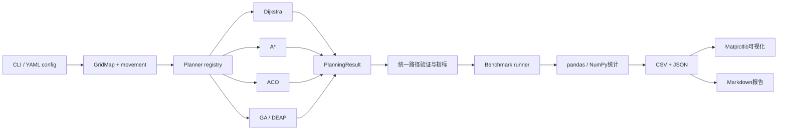

# 阶段0实施设计

**状态：Verified。** 本轮只完成 Read 与 Plan。没有创建`PathPlanningLab`、安装依赖、执行旧代码、修改文件或运行Git写操作。

# 1. 对目标的理解

目标是新建一个与旧材料完全隔离的Python工程，以真实代码、自动化测试、结构化实验数据和可复现实验支撑四算法路径规划表述，而不是包装旧TSP脚本。

项目必须同时满足：

- Dijkstra、A*、ACO、GA运行于同一二维栅格模型。
- 确定性算法验证最优性；随机算法验证种子、稳定性和终止性。
- 所有路径通过统一合法性检查。
- 所有失败样本保留。
- Benchmark、调优、可视化和报告均由代码自动产生。
- 只有全部质量门禁通过，才可标记100%。

## 架构方案比较

| 方案 | 说明 | 取舍 |
|---|---|---|
| A. 单脚本实验 | 四个脚本直接读图、画图 | 开发快，但无法满足统一接口、测试和复现要求 |
| **B. 分层Python包** | 核心地图、算法、benchmark、调优和可视化分离 | **推荐；边界清楚，可测试且不过度抽象** |
| C. 插件式算法平台 | 动态插件、事件总线、数据库式实验管理 | 扩展性强，但明显超出本项目范围 |

采用方案B。CLI直接覆盖地图生成、单次规划、benchmark、调优和报告职责，不另建重复的脚本包装层。

---

# 2. 当前基线摘要

## 环境门禁

| 检查 | 结果 |
|---|---|
| `/Users/jiaxulong/Desktop/PathPlanningLab` | **不存在，可以在批准后新建** |
| 系统Python | `/opt/homebrew/bin/python3`，Python 3.12.2 |
| `venv`模块 | 可用 |
| Git | `/opt/homebrew/bin/git`，2.51.0 |
| pip | 24.0，Python 3.12 |
| 架构 | Apple Silicon `arm64` |
| 可用磁盘 | 约640 GiB |
| 全局pytest/Ruff/mypy | 未发现；不影响，将只装入项目`.venv` |
| `uv` | 未安装；计划使用标准库`venv` |
| 旧目录Git仓库 | 不存在 |

## 旧技术基线

- [ACO.py](</Users/jiaxulong/Desktop/论文与实习/实习/过程/第6周7.31-8.6/ACO.py>)：48城市TSP，正式搜索不执行信息素更新，不能复用为最终实现。
- [GA.py](</Users/jiaxulong/Desktop/论文与实习/实习/过程/第8周8.14-8.20/GA.py>)：48城市TSP示例；有核心遗传循环，但不是栅格路径规划。
- 第8、9周`GA.py`完全相同。
- 只有一组48城市坐标，没有栅格地图、统一接口、测试、依赖、原始结果或benchmark。
- 本轮复核的旧代码哈希与上一轮基线一致。

---

# 3. 新项目架构设计

```text
PathPlanningLab/
├── pyproject.toml
├── requirements.lock
├── README.md
├── .gitignore
├── configs/
│   ├── benchmark_smoke.yaml
│   ├── benchmark_standard.yaml
│   ├── tuning.yaml
│   ├── aco_baseline.yaml
│   ├── aco_tuned.yaml
│   ├── ga_baseline.yaml
│   └── ga_tuned.yaml
├── maps/
│   ├── handcrafted/
│   │   ├── open_20.json
│   │   ├── narrow_channel_20.json
│   │   ├── maze_30.json
│   │   ├── dead_ends_30.json
│   │   ├── bottleneck_50.json
│   │   └── no_path_20.json
│   └── generated/
│       ├── tuning/
│       └── evaluation/
├── src/path_planning/
│   ├── __init__.py
│   ├── cli.py
│   ├── reporting.py
│   ├── core/
│   │   ├── grid.py
│   │   ├── movement.py
│   │   ├── result.py
│   │   ├── validation.py
│   │   └── metrics.py
│   ├── maps/
│   │   ├── generation.py
│   │   ├── io.py
│   │   └── suites.py
│   ├── algorithms/
│   │   ├── base.py
│   │   ├── dijkstra.py
│   │   ├── astar.py
│   │   ├── aco.py
│   │   └── genetic.py
│   ├── benchmark/
│   │   ├── schemas.py
│   │   ├── runner.py
│   │   ├── statistics.py
│   │   └── metadata.py
│   ├── tuning/
│   │   ├── spaces.py
│   │   └── runner.py
│   └── visualization/
│       ├── paths.py
│       ├── convergence.py
│       └── comparisons.py
├── tests/
│   ├── unit/
│   ├── integration/
│   └── regression/
├── results/
│   ├── smoke/
│   ├── tuning/
│   └── standard/
└── docs/
    ├── architecture.md
    ├── algorithms.md
    ├── benchmark_methodology.md
    ├── experiment_report.md
    ├── legacy_baseline.md
    ├── verification_report.md
    └── superpowers/
        ├── specs/2026-07-18-four-algorithm-path-planning-design.md
        └── plans/2026-07-18-path-planning-lab.md
```

## 调用关系



---

# 4. 四算法具体设计

## Dijkstra

- 使用`heapq`优先队列。
- `g_score: dict[Point, float]`保存当前最短距离。
- `came_from`用于路径重建。
- `closed`防止重复扩展。
- 弹出目标节点时提前终止。
- 无路径时返回`success=False`及`failure_reason="no_path"`。
- 4方向成本为1；8方向对角成本默认为`sqrt(2)`。
- `expanded_nodes`按首次关闭节点数计。
- 测量完整`plan()`调用时间。
- 作为同一地图上的最优成本基准。

## A*

- 与Dijkstra共享邻居、移动成本、路径重建和验证逻辑。
- `f = g + h`，但不共享具体搜索循环，避免难以审计的条件分支。
- 4方向默认Manhattan。
- 8方向默认Octile。
- Euclidean允许用于4/8方向。
- 8方向配`sqrt(2)`成本时拒绝Manhattan，防止不可采纳启发式破坏最优性。
- 回归测试要求A*与Dijkstra路径成本一致。
- 不要求具体路径节点序列一致，因为可能存在多条等价最短路径。

## ACO

采用栅格边信息素，而不是旧代码的城市矩阵。

- 信息素结构：`rows × cols × movement_count`的NumPy数组。
- 启发函数：`1 / (goal_distance + epsilon)`。
- 每只蚂蚁从起点逐步选择合法邻居。
- 转移概率：

  `P(i→j) ∝ pheromone(i,j)^alpha × heuristic(j)^beta`

- 使用访问集合避免无限环。
- 死路时进行有限回退；超过回退或步数预算则本次构造失败。
- 单次蚂蚁失败不会删除，记录为失败构造。
- 每轮所有蚂蚁完成后统一挥发。
- 成功路径按`pheromone_deposit / path_length`强化。
- 全局最佳路径额外乘`elite_weight`强化。
- 信息素每轮裁剪到`[min_pheromone, max_pheromone]`。
- 全局保存最优合法路径。
- 连续若干轮无改善后提前终止。
- 所有随机数来自局部`numpy.random.Generator(seed)`。
- 无路径地图先做共享可达性预检，避免无意义长循环；该时间计入总运行时间。

必须单测：

- 成功更新后矩阵非均匀。
- 短路径比长路径获得更多单位强化。
- 挥发率、上下限和精英权重实际改变结果。
- 相同种子得到相同路径、工作量及收敛历史。
- 不同指定种子在分支地图产生不同轨迹。
- 死路和无路径场景有限终止。

---

# 5. GA染色体与路径修复方案

## 方案比较

| 方案 | 优点 | 问题 |
|---|---|---|
| 固定长度移动指令 | 交叉变异简单 | 非法路径多，终点到达率低 |
| 路点＋A*连接 | 很容易生成合法结果 | GA实质依赖A*解题，比较不诚实 |
| **合法坐标路径＋随机局部修复** | 结果可解释，GA仍负责优化 | 算子实现和测试要求较高 |

采用第三种。

## 染色体

DEAP个体为：

```text
[start, point_1, point_2, ..., goal]
```

要求每两个相邻节点均符合相同的4/8方向移动规则。

## 初始化

- 使用随机邻居顺序的有界DFS生成合法路径。
- 使用循环消除得到简单路径。
- 可达性预检只判断是否存在路径，不提供最优路径。
- 每个个体使用同一planner种子派生的独立随机流。

## 交叉

支持两种可调方法：

1. `common_node`：在双亲共有的内部节点处交换后缀；天然保持端点及邻接合法性。
2. `splice_repair`：选择双亲片段拼接，再对断点做有界随机局部连接。

如果交叉无法产生合法后代，保留原父代并记录失败交叉次数，不接受非法高适应度个体。

## 变异

支持：

- `reroute_segment`：选择两个路径节点，用有界随机DFS生成替代片段。
- `shortcut`：尝试用更短的合法局部连接替换原片段。

变异率设为1的测试必须观察到实际变异事件和染色体变化。

## 修复

顺序为：

1. 删除重复环。
2. 检查端点。
3. 找到第一个非法相邻段。
4. 使用有界随机局部连接修补。
5. 再次进行统一路径验证。
6. 修复失败则保留为无效个体并施加支配性惩罚，绝不作为成功结果。

修复不会调用A*或Dijkstra，避免GA借用最优搜索器。

## 适应度

最小化单一可解释分数：

```text
valid path:
    path_length_penalty × path_length
  + turn_penalty × turning_count
  + repeat_penalty × repeated_nodes

invalid path:
    unreachable_base_penalty
  + collision_penalty × collisions
  + remaining_distance_penalty × distance_to_goal
  + 上述长度、转弯和重复项
```

配置校验确保任何非法路径的基础惩罚高于该地图上合法简单路径可能达到的最大分数，防止非法路径“更优”。

## DEAP使用边界

- 使用DEAP的`Toolbox`、Fitness、Individual、选择和精英保留框架。
- 选择、交叉、变异注册为使用局部`random.Random(seed)`的函数，避免污染全局随机状态。
- 对DEAP全局`creator`名称做幂等保护，确保重复导入安全。
- `metadata`记录`evaluations`、交叉事件、变异事件、修复成功/失败次数。

---

# 6. ACO信息素更新方案

每轮严格按以下顺序：

1. 使用当前信息素构造全部蚂蚁路径。
2. 记录成功、失败、工作量和轮内最佳路径。
3. 全局挥发：

   `tau = (1 - evaporation_rate) × tau`

4. 对每条成功路径强化：

   `delta = pheromone_deposit / path_length`

5. 对全局最佳路径额外强化：

   `elite_delta = elite_weight × pheromone_deposit / best_length`

6. 裁剪：

   `tau = clip(tau, min_pheromone, max_pheromone)`

7. 更新全局最佳及收敛历史。
8. 检查最大迭代和停滞提前终止。

闭环测试会直接比较更新前后矩阵，不仅检查最终截图。

---

# 7. 统一接口设计

```python
Point = tuple[int, int]

class Planner(Protocol[ConfigT]):
    name: str

    def plan(
        self,
        grid: GridMap,
        start: Point,
        goal: Point,
        config: ConfigT,
        seed: int | None = None,
    ) -> PlanningResult: ...
```

## GridMap

- `blocked: NDArray[np.bool_]`，`True`表示障碍。
- 构造时复制输入，防止调用方后续静默修改。
- 验证二维、非空、合法dtype。
- `save_json()`和`load_json()`保存网格、名称、生成参数和实际密度。
- 不使用`eval()`或绝对路径。

## MovementConfig

- `connectivity: Literal[4, 8]`
- `diagonal_cost: float = sqrt(2)`
- `allow_corner_cutting: bool = False`

禁止穿墙角时，对角移动要求两个相邻正交单元均可通行。

## PlanningResult

至少包含：

- `algorithm`
- `success`
- `path`
- `path_length`
- `runtime_ms`
- `expanded_nodes`
- `evaluations`
- `iterations`
- `convergence_history`
- `seed`
- `failure_reason`
- `metadata`

全部字段可序列化为JSON。运行时间不参与种子可复现相等性测试。

## 指标语义

- Dijkstra/A*：使用`expanded_nodes`。
- ACO：记录`constructed_paths`和`evaluations`。
- GA：记录适应度`evaluations`。
- 不把三者伪装成同一个“搜索节点数”。
- `normalized_path_cost = path_length / 同图Dijkstra最优成本`。
- 失败运行的标准化成本为空值，仍保留在原始结果中。

---

# 8. 地图与Benchmark设计

## 地图

手工地图：

1. 空旷20×20。
2. 狭窄通道20×20。
3. 迷宫30×30。
4. 多死路30×30。
5. 瓶颈50×50。
6. 无路径20×20。

随机评测地图：

- 尺寸：20、50、100。
- 障碍密度：10%、20%、30%。
- 共9张基础地图。
- 使用固定生成种子。
- 先保留一条确定性可达走廊，再按目标密度放置其余障碍。
- 保存生成种子、目标密度、实际密度和生成方法。

调优地图与最终评测地图使用不同生成种子和不同文件路径。

## Smoke Benchmark

- `open_20`、`maze_30`、`no_path_20`。
- Dijkstra/A*各运行一次。
- ACO/GA使用3个固定种子及缩减预算。
- 输出完整CSV、JSON和少量PNG。
- 目标运行时间：约1–5分钟。
- 用于CLI、CI式回归和产物结构验证。

## Standard Benchmark

- 15张基础地图全部运行4方向。
- 另选6张代表地图运行8方向：
  - 迷宫、瓶颈、无路径。
  - 20×20/20%、50×50/20%、100×100/20%随机地图。
- 共21个统一任务。
- ACO和GA的baseline、tuned版本各使用20个固定种子。
- 预计随机算法运行数：`21 × 2算法 × 2配置 × 20 = 1680`。
- Dijkstra/A*每个任务先预热3次，再记录10次运行时间。
- 所有异常值和失败结果原样保存。
- 汇总使用均值、标准差、中位数、最小值和最大值。

## 公平性

- 同一任务共用同一地图对象、起点、终点和移动成本。
- 所有算法调用同一合法性检查器。
- 不将调优地图纳入最终结论。
- 不删除失败或异常值。
- 路径成本以Dijkstra为最优参照。
- ACO/GA预算、参数和种子写入每条原始记录。
- 文档明确区分确定性和随机算法。

---

# 9. 参数调优设计

不做不可承受的全笛卡尔积；采用“两阶段真实调优”。

## 调优地图

4个独立任务：

- 20×20、10%。
- 20×20、30%。
- 50×50、20%。
- 50×50、30%。
- 4方向和8方向均有代表。
- 地图种子与最终评测完全不同。

## 第一阶段：单参数粗搜索

- 以baseline为中心，每个数值参数测试低/中/高。
- 类别参数测试所有已实现方法。
- 每组使用3个固定随机种子。
- 其他参数保持baseline。
- 保存全部失败和结果。

ACO搜索：

- `number_of_ants`
- `alpha`
- `beta`
- `evaporation_rate`
- `pheromone_deposit`
- `elite_weight`
- `min_pheromone`
- `max_pheromone`
- `max_iterations`
- `max_steps`

GA搜索：

- `population_size`
- `selection_method`
- `crossover_method`
- `crossover_rate`
- `mutation_method`
- `mutation_rate`
- `elite_size`
- `max_generations`
- `tournament_size`
- 长度、碰撞、重复、转弯惩罚

## 第二阶段：联合复核

- 从粗搜索选取不超过6个组合。
- 每个组合在4张调优地图上使用10个种子。
- 排序首先看成功率，其次看标准化路径成本、稳定性和计算预算。
- 最佳配置固化至`tuned.yaml`。
- 只有此后才在独立Standard地图上比较baseline/tuned。
- tuned未改善时如实报告，不重新定义指标。

---

# 10. 测试矩阵

| 模块 | 关键测试 |
|---|---|
| GridMap | 非二维、空数组、错误dtype、边界、障碍端点、JSON往返 |
| Movement | 4/8方向、对角成本、禁止/允许穿墙角 |
| Map generation | 同种子相同地图、目标密度、保证可达、无路径地图 |
| Path validation | 起终点、相邻规则、越界、障碍、墙角、空路径 |
| PlanningResult | 成功/失败约束、JSON序列化、非JSON元数据拒绝 |
| Metrics | 路径长度、转弯数、标准化成本 |
| Dijkstra | 手算最短路径、4/8方向、起终点相同、无路径、提前终止 |
| A* | 三种启发式、与Dijkstra成本一致、非法启发式组合拒绝 |
| ACO | 非均匀更新、强化方向、挥发生效、上下限、种子、死路终止 |
| GA | 初始化、解码、选择、两种交叉、两种变异、修复、惩罚、种子 |
| Shared integration | 四算法同图、统一结果、所有成功路径均合法 |
| Benchmark | 失败保留、CSV/JSON schema、统计值、元数据和Dijkstra归一化 |
| Tuning | 调优/评测地图隔离、所有候选结果保存、选择依据稳定 |
| Visualization | 使用Agg后端、PNG存在且非空、失败场景可绘制 |
| CLI | 单次规划、地图生成、smoke benchmark、错误退出码 |
| Regression | A*/Dijkstra最优性、ACO旧缺陷回归、无路径有限终止 |
| Packaging | 可导入、无import副作用、wheel构建、`pip check` |

执行测试时固定：

```bash
TMPDIR="$PROJECT_ROOT/.tmp"
MPLCONFIGDIR="$PROJECT_ROOT/.mplconfig"
PYTHONPYCACHEPREFIX="$PROJECT_ROOT/.pycache"
.venv/bin/python -m pytest --basetemp="$PROJECT_ROOT/.pytest-tmp"
```

目标：

- 不使用`skip`或`xfail`掩盖失败。
- 整个包争取≥90%；核心和算法模块必须≥90%。
- Ruff、mypy、构建和CLI均为独立门禁。

---

# 11. 分阶段文件修改计划

## 阶段1：仓库、骨架和核心模型

创建：

- `pyproject.toml`、`.gitignore`、`README.md`
- `requirements.lock`
- `src/path_planning/__init__.py`
- `core/grid.py`、`movement.py`、`result.py`、`validation.py`、`metrics.py`
- `maps/generation.py`、`io.py`、`suites.py`
- 核心及地图测试
- 6张手工地图
- 批准后的设计及实施计划文档
- `docs/legacy_baseline.md`

流程：

1. 目标路径仍不存在才创建。
2. `git init -b main`。
3. TDD完成最小包骨架并验证。
4. 创建main初始化提交。
5. 创建`feature/path-planning-100`。
6. TDD完成核心模型。
7. 运行核心测试、Ruff、mypy、diff审查。
8. 创建阶段1checkpoint。

## 阶段2：Dijkstra和A*

创建：

- `algorithms/base.py`
- `dijkstra.py`
- `astar.py`
- 确定性算法单元、集成和回归测试
- `docs/algorithms.md`对应章节

验收：

- 手算地图通过。
- A*和Dijkstra成本一致。
- 无路径有限返回。
- 阶段Verified后checkpoint。

## 阶段3：ACO

创建：

- `algorithms/aco.py`
- ACO单元、集成、种子和回归测试
- `configs/aco_baseline.yaml`
- ACO算法文档

先写失败测试重现旧基线中的：

- 更新矩阵保持均匀。
- 正式搜索不调用信息素更新。
- 闭环/边更新不完整。

新实现不得复制旧调用链。全部通过后checkpoint。

## 阶段4：GA

创建：

- `algorithms/genetic.py`
- GA初始化、算子、修复、惩罚、种子和终止测试
- `configs/ga_baseline.yaml`
- GA设计文档

使用DEAP，但所有项目行为由本项目测试约束。通过后checkpoint。

## 阶段5：Benchmark与统计

创建：

- `benchmark/schemas.py`
- `runner.py`
- `statistics.py`
- `metadata.py`
- `configs/benchmark_smoke.yaml`
- `configs/benchmark_standard.yaml`
- Benchmark和统计测试
- Smoke原始结果及汇总

验证Smoke成功后checkpoint。

## 阶段6：参数调优

创建：

- `tuning/spaces.py`
- `tuning/runner.py`
- `configs/tuning.yaml`
- tuned配置
- 调优测试
- `results/tuning/`全部候选结果
- baseline/tuned选择说明

调优集完成且结果可追踪后checkpoint。

## 阶段7：可视化、CLI和文档

创建：

- `visualization/paths.py`
- `convergence.py`
- `comparisons.py`
- `cli.py`
- `reporting.py`
- 可视化和CLI测试
- `docs/architecture.md`
- `docs/benchmark_methodology.md`
- README完整复现说明

运行完整测试和Smoke后checkpoint。

## 阶段8：独立验收

创建：

- 项目内`.venv-verify`
- `results/standard/`原始CSV/JSON、汇总和PNG
- `docs/experiment_report.md`
- `docs/verification_report.md`

验证顺序：

1. 新验证虚拟环境安装。
2. `pip check`。
3. Ruff检查与格式检查。
4. mypy。
5. 全部pytest与覆盖率。
6. wheel构建。
7. CLI单次规划。
8. Smoke。
9. Standard。
10. 报告自动生成。
11. Git diff、绝对路径、密钥、大文件和未跟踪文件检查。
12. 提交结果checkpoint。
13. 在提交后再次运行最小最终门禁，形成最终状态。

任何关键门禁失败都不宣布100%。

---

# 12. 依赖及安装计划

## 直接运行依赖

- NumPy
- Matplotlib
- pandas
- PyYAML
- DEAP

## 开发依赖

- pytest
- pytest-cov
- Ruff
- mypy

## 构建依赖

建议允许`setuptools`作为PEP 517构建后端。它不参与算法运行，但没有构建后端就无法满足“项目包能够构建”。

不增加`build`包；使用：

```bash
.venv/bin/python -m pip wheel . --no-deps --wheel-dir dist
```

## 安装方式

批准后：

```bash
cd /Users/jiaxulong/Desktop/PathPlanningLab
/opt/homebrew/bin/python3 -m venv .venv

export TMPDIR="$PWD/.tmp"
export PIP_CACHE_DIR="$PWD/.pip-cache"
export XDG_CACHE_HOME="$PWD/.cache"
export MPLCONFIGDIR="$PWD/.mplconfig"
export PYTHONPYCACHEPREFIX="$PWD/.pycache"

.venv/bin/python -m pip install -e ".[dev]"
```

所有缓存、临时目录和虚拟环境均定向到项目内部并加入`.gitignore`。不升级全局pip，不修改全局Python。

安装解析完成后，把准确版本写入`requirements.lock`并提交。所有直接依赖仍统一声明在`pyproject.toml`。

对缺少类型声明的DEAP/Matplotlib，仅使用精确的mypy模块级override；不放宽本项目核心类型检查。

---

# 13. 风险和回滚方案

**风险等级：Medium。** 旧材料完全隔离且新项目可通过Git恢复，但随机优化算法、长时间benchmark和依赖安装具有实际不确定性。

| 风险 | 控制措施 |
|---|---|
| 目标目录在批准前被其他程序创建 | 阶段1第一步重新检查；存在即停止 |
| ACO在100×100地图运行过慢 | 明确计算预算、早停和工作量；不得删除复杂场景 |
| GA难以在高密度地图稳定成功 | 合法路径初始化、局部修复、成功率优先调优 |
| 过度依赖A*/Dijkstra辅助随机算法 | 只允许可达性预检；GA修复不调用最优搜索器 |
| runtime噪声 | 预热、重复测量、中位数、环境元数据 |
| tuned结果未改善 | 原样报告，不更改指标 |
| 标准实验文件过多 | 每图生成代表性路径图；全部数值保留，避免每种子大量PNG |
| 结果体积超出预期 | 预计50–250 MB；若单文件或总量明显超出则暂停 |
| DEAP全局creator冲突 | 幂等注册并做重复导入测试 |
| 第三方依赖下载失败 | 同一方式最多重试一次；两次失败后暂停 |
| 覆盖率不足 | 补真实行为测试，不排除核心代码或降低门槛 |
| Git身份未配置 | 使用现有身份；不存在则在首次提交前暂停，不自行改全局配置 |

## 回滚

- 旧材料未修改，不需要回滚。
- `main`保留初始化基线。
- 每个Verified阶段有独立checkpoint。
- 可通过`git switch main`查看空白基线。
- 单阶段回滚推荐`git revert <checkpoint>`，保留历史。
- 不计划使用`reset --hard`、rebase或强制操作。
- 阶段未提交而失败时保留现场并报告，不擅自删除或恢复文件。

---

# 14. 预计耗时较高的验证环节

| 环节 | 初步估计 |
|---|---:|
| 首次虚拟环境安装 | 5–20分钟，取决于网络 |
| 全量测试、覆盖率、Ruff、mypy、构建 | 3–10分钟 |
| Smoke benchmark | 1–5分钟 |
| ACO/GA粗调＋联合复核 | 约4–12小时 |
| Standard benchmark | 约6–24小时 |
| 图表和Markdown报告生成 | 5–30分钟 |
| 干净环境独立验收 | 15–45分钟，不含Standard重跑 |

这些是保守估计。实际时间取决于100×100场景中ACO/GA单次预算。若标准实验超过24小时或资源占用异常，将暂停报告，不静默缩小验收范围。

---

# 15. 需要你决定的事项

没有架构层面的阻塞性歧义。建议将以下默认项与整份计划一起批准：

1. 允许在项目`.venv`中从PyPI下载你已列出的直接依赖及其必要传递依赖。
2. 允许`setuptools`作为唯一新增的构建后端依赖；不新增`build`。
3. 使用Python 3.12.2，而不是另行安装Python 3.11。
4. 采用“合法坐标路径＋随机局部修复”的GA方案，不使用A*修复。
5. 采用21个Standard统一任务、随机算法每配置20种子。
6. Standard默认顺序执行；只有实测不可接受时才暂停讨论并行化。
7. 把最终Standard原始数据、汇总、PNG和Markdown报告纳入本地Git。
8. 结果如实报告，不保证tuned优于baseline，也不预设任何提升百分比。
9. 最终停留在`feature/path-planning-100`，不merge、不push、不tag。
10. 如果Git身份缺失、目标目录突然存在、需要未列出的直接依赖或实验规模异常，将按要求暂停。

本轮没有创建或修改任何文件，也没有执行旧代码或Git写操作。

如认可上述默认项及完整计划，请明确回复：

**“批准该计划，按计划从阶段1开始执行。”**
